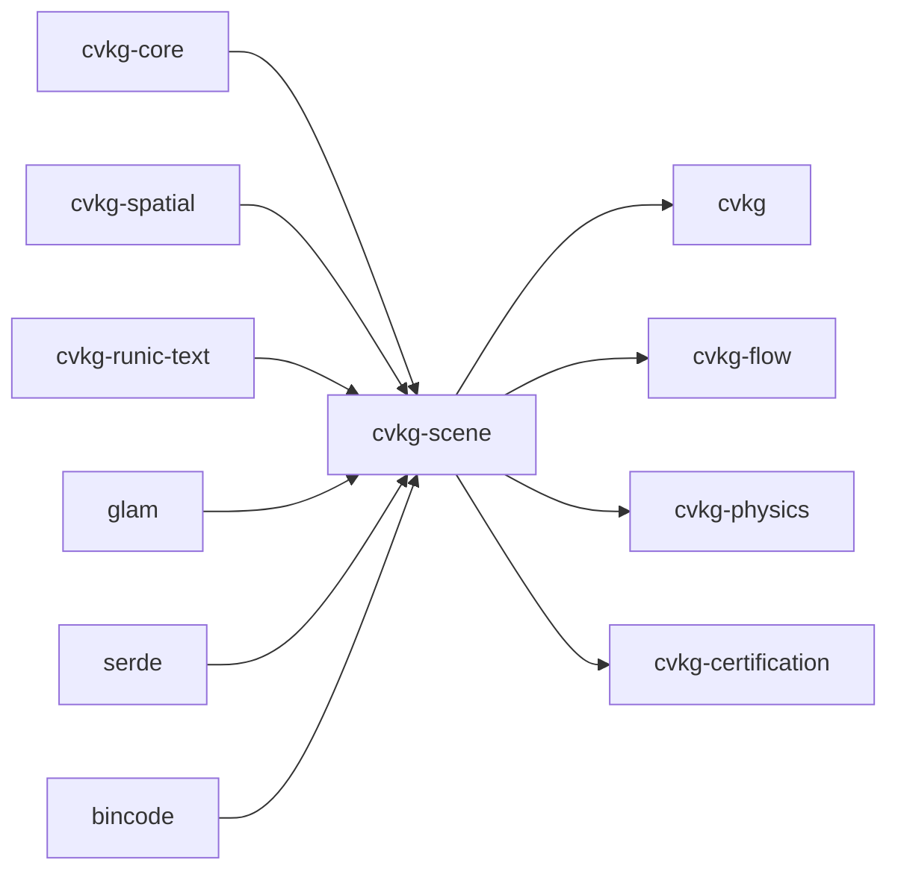

# cvkg-scene

## Purpose

Retained scene graph for the CVKG UI framework. Manages a tree of rendered nodes with hierarchical AABB culling, automatic layering for GPU batching, and dirty-rect tracking for incremental updates. The graph is "retained" — nodes persist across frames and are mutated in place via patches, avoiding full-tree reconstruction each frame.

## Boundaries

- **In**: node storage (`VNode`, `NodeId`), transform propagation, AABB culling, spatial hash indexing, layer batching, dirty-rect tracking, binary serialization, patch-based incremental updates.
- **Out**: rendering (consumed by Surtr GPU pipeline), layout computation (handled upstream), text shaping (delegated to `cvkg-runic-text`), component definition (lives in `cvkg-components`).

This crate does not depend on any GPU or windowing API.

## Dependency graph



## Public API overview

| Item | Kind | Description |
|------|------|-------------|
| `SceneGraph` | struct | The retained scene graph. Stores nodes, dirty regions, and a spatial hash index. |
| `VNode` | struct | A single node: id, component type, children, local/world rects, dirty flag, layer, z-index, optional 3D transform. |
| `NodeId` | type alias | `KvasirId` — platform-wide unique identifier re-exported from `cvkg-core`. |
| `Patch` | enum | Incremental update: `Create`, `Remove`, `Update`, `Move`. |
| `Change` | enum | Property-level mutation: `ComponentType`, `Children`, `LocalRect`, `LayerId`, `ZIndex`. |
| `Bvh`, `BvhNode`, `Quadtree`, `SpatialHash` | re-export | Spatial structures from `cvkg-spatial`, re-exported for backward compatibility. |

### Key methods on `SceneGraph`

- `new()` — create an empty graph.
- `next_id()` — allocate a fresh `NodeId`.
- `add_node(node, parent)` — insert a node, optionally attach to a parent.
- `update_transforms()` — recompute world-space bounds recursively and rebuild the spatial hash.
- `cull(viewport)` — hierarchical AABB culling; returns `Vec<NodeId>` visible within the viewport.
- `query_region(rect)` — spatial hash query returning candidate nodes overlapping a rect.
- `batch(visible_nodes)` — group nodes into layers (`BTreeMap<u32, Vec<NodeId>>`), sorted by z-index within each layer.
- `serialize_binary()` / `deserialize_binary(data)` — bincode serialization of nodes and root.
- `dirty_regions()` — accumulated dirty rects since last clear.
- `clear_dirty()` — merge overlapping dirty regions, reset all dirty flags.
- `apply_patch(patch)` / `apply_patches(patches)` — apply incremental updates.

## Usage example

```rust
use cvkg_scene::{SceneGraph, VNode, Patch, Change, Rect, NodeId};
use cvkg_core::KvasirId;

let mut scene = SceneGraph::new();

// Allocate ids and create nodes
let root_id = scene.next_id();
let child_id = scene.next_id();

let root = VNode::new(root_id, "Panel", Rect { x: 0.0, y: 0.0, width: 800.0, height: 600.0 });
scene.add_node(root, None);

let child = VNode::new(child_id, "Button", Rect { x: 10.0, y: 20.0, width: 120.0, height: 40.0 });
scene.add_node(child, Some(root_id));

// Compute world bounds and build spatial index
scene.update_transforms();

// Cull to viewport
let visible = scene.cull(Rect { x: 0.0, y: 0.0, width: 400.0, height: 300.0 });

// Batch into layers for GPU submission
let batches = scene.batch(&visible);

// Apply incremental patch
scene.apply_patch(Patch::Update {
    id: child_id,
    changes: vec![Change::LocalRect(Rect { x: 10.0, y: 20.0, width: 160.0, height: 40.0 })],
});

// Serialize for network sync
let bytes = scene.serialize_binary().unwrap();
let restored = SceneGraph::deserialize_binary(&bytes).unwrap();
```

## Use cases

- **UI rendering pipeline**: retain the widget tree across frames, only re-render dirty regions.
- **Scrolling/panning**: cull off-screen nodes via `cull()` before submitting draw calls.
- **GPU batching**: group visible nodes by `layer_id` and z-index via `batch()` to minimize draw-call count.
- **Network sync**: serialize the graph with `serialize_binary()` for sub-millisecond state transfer.
- **Incremental updates**: stream `Patch` operations from a state diff instead of rebuilding the tree.
- **Spatial queries**: use `query_region()` for hit-testing or focus-at-point lookups.

## Edge cases and limitations

- **Negative coordinates**: the spatial hash uses signed `i32` cell coordinates internally. Cell keys are offset by `1 << 30`, supporting coordinates up to ~32M cells in either direction. `encode_cell_key` returns `None` for out-of-range cells, which are silently dropped from the index.
- **Dirty-rect merging**: `clear_dirty()` merges overlapping rects using a quadtree-based intersection pass. Worst-case complexity is O(n^2) per merge pass; scenes with thousands of disjoint dirty regions per frame may see overhead.
- **3D nodes**: when `VNode::is_3d` is true, the 3D transform fields (`position_3d`, `rotation_3d`, `scale_3d`) are authoritative and 2D fields are derived. The 2D fallback path (`local_rect`, `z_index`) is used when `is_3d` is false.
- **Serialization scope**: `serialize_binary` only persists `nodes` and `root`. Dirty regions, spatial grid, and the ID counter are reset on deserialization.
- **Root-only parenting**: `add_node` with `parent: None` sets the root if no root exists; subsequent root-less adds are inserted but not attached to the tree. Callers must manage parent links explicitly.
- **Culling is viewport-only**: the `cull()` method performs AABB containment tests against a single `Rect`. No frustum, occlusion, or hierarchical-Z culling is performed.

## Build flags / features / env vars

This crate has no Cargo features. All functionality is always enabled.

| Dependency | Notes |
|------------|-------|
| `cvkg-core` | `KvasirId`, `Rect` |
| `cvkg-spatial` | `Bvh`, `BvhNode`, `Quadtree`, `SpatialHash` (re-exported) |
| `cvkg-runic-text` | Linked as a dependency; not directly re-exported |
| `glam` | Enabled with `serde` and `bytemuck` features |
| `serde` | `derive` feature enabled; `VNode` and `SceneGraph` are `Serialize + Deserialize` |
| `bincode` | Used for `serialize_binary` / `deserialize_binary` |

No environment variables or build-time configuration are read at compile or runtime.
