# cvkg-scene

```mermaid
graph TD
    cvkg-core["cvkg-core"]
    cvkg-vdom["cvkg-vdom"]
    cvkg-scene["cvkg-scene"]
    cvkg-layout["cvkg-layout"]
    cvkg-render-gpu["cvkg-render-gpu"]
    cvkg-render-native["cvkg-render-native"]
    cvkg-compositor["cvkg-compositor"]
    cvkg-themes["cvkg-themes"]
    cvkg-anim["cvkg-anim"]
    cvkg-flow["cvkg-flow"]
    cvkg-runic-text["cvkg-runic-text"]
    cvkg-svg-filters["cvkg-svg-filters"]
    cvkg-svg-serialize["cvkg-svg-serialize"]
    cvkg-components["cvkg-components"]
    cvkg-macros["cvkg-macros"]
    cvkg-cli["cvkg-cli"]
    cvkg-webkit-server["cvkg-webkit-server"]
    cvkg-test["cvkg-test"]
    cvkg-physics["cvkg-physics"]
    cvkg["cvkg (umbrella)"]

    cvkg-vdom --> cvkg-core
    cvkg-vdom --> cvkg-scene
    cvkg-layout --> cvkg-core
    cvkg-layout --> cvkg-anim
    cvkg-scene --> cvkg-core

    cvkg-render-gpu --> cvkg-core
    cvkg-render-gpu --> cvkg-compositor
    cvkg-render-gpu --> cvkg-svg-filters
    cvkg-render-gpu --> cvkg-svg-serialize
    cvkg-render-gpu --> cvkg-runic-text

    cvkg-render-native --> cvkg-core
    cvkg-render-native --> cvkg-render-gpu
    cvkg-render-native --> cvkg-vdom
    cvkg-render-native --> cvkg-themes

    cvkg-compositor --> cvkg-core

    cvkg-themes --> cvkg-core
    cvkg-themes --> cvkg-anim
    cvkg-anim --> cvkg-core
    cvkg-flow --> cvkg-core
    cvkg-flow --> cvkg-scene
    cvkg-flow --> cvkg-themes

    cvkg-runic-text --> cvkg-core
    cvkg-svg-filters --> cvkg-core

    cvkg-components --> cvkg-core
    cvkg-components --> cvkg-vdom
    cvkg-components --> cvkg-layout
    cvkg-components --> cvkg-themes
    cvkg-components --> cvkg-anim
    cvkg-components --> cvkg-runic-text

    cvkg-macros --> cvkg-core
    cvkg-cli --> cvkg-core
    cvkg-cli --> cvkg-physics
    cvkg-cli --> cvkg-anim
    cvkg-cli --> cvkg-macros
    cvkg-webkit-server --> cvkg-cli
    cvkg-physics --> cvkg-core
    cvkg-physics --> cvkg-scene

    cvkg --> cvkg-core
    cvkg --> cvkg-vdom
    cvkg --> cvkg-scene
    cvkg --> cvkg-layout
    cvkg --> cvkg-themes
    cvkg --> cvkg-anim
    cvkg --> cvkg-macros
    cvkg --> cvkg-components
    cvkg --> cvkg-render-gpu
    cvkg --> cvkg-render-native
```



`cvkg-scene` implements a high-performance retained scene graph for CVKG, providing hierarchical culling, automatic layering, and binary serialization for the GPU pipeline.

## Boundaries and Responsibilities

This crate serves as the bridge between the logical UI (VDOM) and the GPU renderer (Surtr). It does NOT handle event logic or layout calculation. It focuses on:
- Maintaining a retained tree of rendered nodes for efficient differential updates.
- Performing hierarchical Axis-Aligned Bounding Box (AABB) culling.
- Grouping visible nodes into layers for GPU batching.
- Tracking dirty regions to minimize redraw areas.

## Public API Overview

### Core Types
- `SceneGraph`: The central manager for retained nodes and spatial queries.
- `VNode`: A node in the scene graph containing world-space bounds and layering metadata.
- `NodeId`: Unique identifier for scene nodes.

### Spatial Operations
- `SceneGraph::update_transforms()`: Recursively computes absolute world-space bounds from local coordinates.
- `SceneGraph::cull(viewport)`: Returns the IDs of all nodes visible within the given rect.
- `SceneGraph::batch(visible_nodes)`: Organizes nodes into layer-specific buckets for rendering.

### Synchronization
- `SceneGraph::serialize_binary()`: High-speed bincode-based serialization for sub-millisecond state transfer.

## Usage Example

```rust
use cvkg_scene::{SceneGraph, VNode};
use cvkg_core::Rect;

let mut scene = SceneGraph::new();

// Add a node
let id = scene.next_id();
let node = VNode::new(id, "Rect", Rect { x: 10.0, y: 10.0, width: 100.0, height: 100.0 });
scene.add_node(node, None);

// Update transforms and cull
scene.update_transforms();
let visible = scene.cull(Rect { x: 0.0, y: 0.0, width: 800.0, height: 600.0 });

// Batch for rendering
let batches = scene.batch(&visible);
```

## Known Limitations
- Culling is currently based on simple AABB intersections; complex non-convex clipping is handled at the shader level.
- The scene graph assumes a 2D coordinate system with Z-depth layering.
