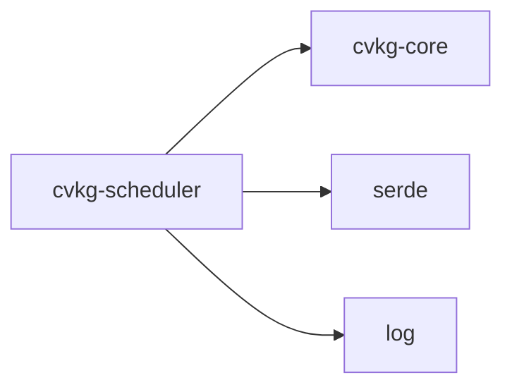

# cvkg-scheduler

Frame and task scheduling for platform-wide update ordering in CVKG.

## Boundaries

This crate owns two things:

1. **Frame phase ordering** — the `FrameScheduler` drives a frame through the fixed pipeline `Input → State → Layout → Animation → Render → Composite → PostFrame`.
2. **Priority task queuing** — the `TaskScheduler` executes submitted closures in `Critical > High > Normal > Idle` order.

This crate does **not** own the actual work (layout, animation, rendering, etc.). It only orders and dispatches it. Subsystems submit closures; the scheduler decides when they run.

## Dependency graph



Reverse dependents: none in the workspace.

## Public API overview

Re-exports from `lib.rs`:

| Symbol | Kind | Source module |
|---|---|---|
| `FrameScheduler` | struct | `frame` |
| `FramePhase` | enum | `frame` |
| `Priority` | enum | `task` |
| `Task` | struct | `task` |
| `TaskHandle` | struct | `task` |
| `TaskScheduler` | struct | `task` |

### `Priority` variants

```
Critical = 0  →  input, state resolution
High     = 1  →  layout, animation
Normal   = 2  →  general work
Idle     = 3  →  telemetry, prefetch
```

Lower discriminant = higher urgency. `Priority` derives `Ord` so `Critical < High < Normal < Idle`.

### `FramePhase` variants

```
Input → State → Layout → Animation → Render → Composite → PostFrame
```

`FramePhase::next()` returns the following phase, or `None` at `PostFrame`. Phases are monotonic within a frame — the scheduler does not support going backwards.

### `FrameScheduler` key methods

| Method | Signature | Purpose |
|---|---|---|
| `new` | `() -> Self` | Create scheduler at frame 0, phase `Input` |
| `begin_frame` | `(&mut self)` | Increment frame counter, reset phase to `Input`, drop unflushed tasks |
| `advance_phase` | `(&mut self) -> FramePhase` | Move to next phase; clamps at `PostFrame` |
| `current_phase` | `(&self) -> FramePhase` | Read current phase |
| `frame_number` | `(&self) -> u64` | Read current frame number (0 before first `begin_frame`) |
| `submit_for_phase` | `(&mut self, phase: FramePhase, work: impl FnOnce() + Send + 'static) -> TaskHandle` | Queue work for a specific phase |
| `cancel_phase_task` | `(&mut self, handle: &TaskHandle)` | Remove a pending phase task by handle |
| `flush_current_phase` | `(&mut self)` | Execute all tasks targeting the current phase, then flush the inner `TaskScheduler` |

### `TaskScheduler` key methods

| Method | Signature | Purpose |
|---|---|---|
| `new` | `() -> Self` | Create empty scheduler |
| `submit` | `(&mut self, Priority, &'static str, impl FnOnce() + Send + 'static) -> TaskHandle` | Queue a task |
| `submit_boxed` | `(&mut self, Priority, &'static str, Box<dyn FnOnce() + Send>) -> TaskHandle` | Queue a pre-boxed task (avoids double-boxing) |
| `run_all` | `(&mut self)` | Drain and execute all tasks in priority order |
| `run_priority` | `(&mut self, min_priority: Priority)` | Execute only tasks at or above `min_priority`; leave the rest queued |
| `pending_count` | `(&self) -> usize` | Number of queued tasks |
| `cancel` | `(&mut self, handle: &TaskHandle)` | Remove a pending task by handle |

## Usage example

```rust
use cvkg_scheduler::{FrameScheduler, FramePhase, Priority, TaskScheduler};

fn main() {
    let mut fs = FrameScheduler::new();
    fs.begin_frame();

    // Submit work for specific phases.
    fs.submit_for_phase(FramePhase::Layout, || {
        // run layout pass
    });
    fs.submit_for_phase(FramePhase::Animation, || {
        // step animations
    });

    // Ad-hoc priority work via the inner TaskScheduler.
    fs.submit_for_phase(FramePhase::Render, || {
        // submit render commands
    });

    // Drive the frame pipeline.
    loop {
        fs.flush_current_phase();
        if fs.current_phase() == FramePhase::PostFrame {
            break;
        }
        fs.advance_phase();
    }
    // Frame complete. frame_number() == 1.
}
```

## Use cases

- **Ordered frame execution** — guarantee that layout always runs before render, and state always runs before animation, across all subsystems.
- **Priority-based task dispatch** — subsystems submit work at the appropriate priority without needing to know about each other.
- **Phase-scoped cancellation** — a subsystem can cancel a task it submitted for a later phase if the work becomes irrelevant (e.g., a streaming source disconnects).
- **Ad-hoc priority work within a phase** — the inner `TaskScheduler` is exposed for callers that need fine-grained priority ordering inside a single phase flush.

## Edge cases and limitations

- **No backward phase transitions.** Once the scheduler advances past a phase, tasks submitted for that phase in the current frame are silently skipped. They will not execute until the next `begin_frame`.
- **Unflushed tasks are dropped on `begin_frame`.** If a frame ends without flushing all phases, the remaining closures are discarded.
- **Panic in a task kills the flush batch.** `run_all` and `run_priority` do not catch panics. A panicked task will prevent subsequent tasks in the same drain from executing.
- **O(n) cancellation.** `TaskScheduler::cancel` and `FrameScheduler::cancel_phase_task` scan the entire queue. This is acceptable for the expected frame budget of < 64 tasks.
- **No `unsafe`.** The entire crate is `#![forbid(unsafe_code)]` (enforced by workspace policy).
- **Single-threaded execution.** Tasks run on the calling thread. The `Send` bound on closures exists for forward-compatibility but the current implementation does not spawn threads.

## Build flags / features / env vars

- **Crate features:** none.
- **Environment variables:** none.
- **Feature flags:** none.
