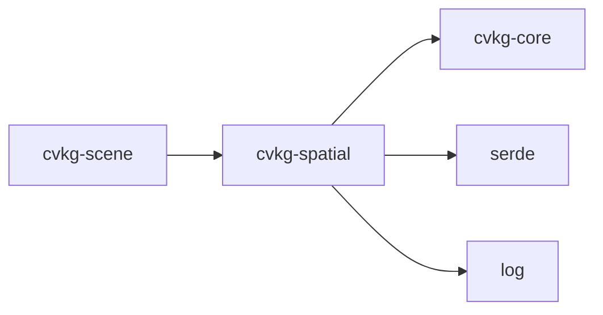

# cvkg-spatial

Canonical spatial indexing for the CVKG platform. Provides three broad-phase spatial query structures — `Quadtree`, `Bvh`, and `SpatialHash` — used by Scene, Physics, Flow, and Layout.

## Boundaries

This crate provides **spatial indexing only**. It does not own scene data, physics bodies, or layout logic. It accepts axis-aligned bounding rects (`cvkg_core::Rect`) and returns candidate matches. Exact intersection testing is always the caller's responsibility.

All three structures are designed for **per-frame rebuild** patterns: insert items, query, then clear and rebuild next frame. There is no incremental update API.

## Dependency graph



## Public API overview

### `Quadtree`

| Method | Signature | Description |
|---|---|---|
| `new` | `(bounds: Rect) -> Self` | Create a root node covering `bounds`. Default: 10 rects per leaf, max depth 5. |
| `insert` | `(&mut self, rect: Rect)` | Insert a rect. Silently dropped if outside `bounds`. |
| `retrieve` | `(&self, rect: Rect, out: &mut Vec<Rect>)` | Broad-phase query. Appends candidate rects to `out`. Callers must test exact overlap. |

No `clear` on `Quadtree` — drop and reconstruct to reset.

### `Bvh<T: Clone>`

| Method | Signature | Description |
|---|---|---|
| `new` | `() -> Self` | Create an empty BVH. |
| `insert` | `(&mut self, rect: Rect, item: T)` | Stage an item with its bounding rect. Invalidates the tree. |
| `build` | `(&mut self)` | Rebuild the BVH tree. Must be called after all `insert` and before any `query`. |
| `query` | `(&self, rect: Rect) -> Vec<&T>` | Return references to items whose AABB overlaps `rect`. Empty if `build` not called. |
| `len` | `(&self) -> usize` | Number of inserted items. |
| `is_empty` | `(&self) -> bool` | `true` if no items inserted since last `clear`. |
| `clear` | `(&mut self)` | Remove all items and discard the tree. |

Lifecycle: `insert` × N → `build` → `query` × N → `clear`.

### `SpatialHash<T: Clone>`

| Method | Signature | Description |
|---|---|---|
| `new` | `(cell_size: f32) -> Option<Self>` | Create with given cell size. Returns `None` if `cell_size <= 0.0`. |
| `insert` | `(&mut self, rect: Rect, item: T)` | Register `item` in every cell `rect` overlaps. Item is cloned per cell. |
| `query` | `(&self, rect: Rect) -> Vec<T>` | Return all items in cells overlapping `rect`. May contain duplicates. |
| `clear` | `(&mut self)` | Remove all items. Does not free HashMap capacity. |
| `len` | `(&self) -> usize` | Number of cell-item registrations (not unique items). |
| `is_empty` | `(&self) -> bool` | `true` if no registrations since last `clear`. |

### Re-exports

```rust
pub use bvh::{Bvh, BvhNode};
pub use quadtree::Quadtree;
pub use spatial_hash::SpatialHash;
```

`BvhNode` is re-exported for callers that need to inspect the tree structure directly.

## Usage example

```rust
use cvkg_spatial::{Bvh, Quadtree, SpatialHash};
use cvkg_core::Rect;

fn main() {
    // --- BVH ---
    let mut bvh: Bvh<u32> = Bvh::new();
    bvh.insert(Rect { x: 10.0, y: 10.0, w: 20.0, h: 20.0 }, 1);
    bvh.insert(Rect { x: 500.0, y: 500.0, w: 20.0, h: 20.0 }, 2);
    bvh.build();
    let hits = bvh.query(Rect { x: 0.0, y: 0.0, w: 50.0, h: 50.0 });
    assert_eq!(hits, vec![&1]);

    // --- Quadtree ---
    let mut qt = Quadtree::new(Rect { x: 0.0, y: 0.0, w: 1000.0, h: 1000.0 });
    qt.insert(Rect { x: 100.0, y: 100.0, w: 50.0, h: 50.0 });
    let mut candidates = Vec::new();
    qt.retrieve(Rect { x: 90.0, y: 90.0, w: 30.0, h: 30.0 }, &mut candidates);
    assert!(!candidates.is_empty());

    // --- SpatialHash ---
    let mut sh = SpatialHash::new(64.0).unwrap();
    sh.insert(Rect { x: 5.0, y: 5.0, w: 10.0, h: 10.0 }, "node_a");
    let results = sh.query(Rect { x: 0.0, y: 0.0, w: 20.0, h: 20.0 });
    assert!(results.contains(&"node_a"));
}
```

## Use cases

- **Scene picking** (`cvkg-scene`): query which graph nodes overlap a mouse cursor or selection rect using `Bvh`.
- **Broad-phase collision detection**: `SpatialHash` for uniform-density object sets where per-frame rebuild is acceptable.
- **Dirty-rect merging**: `Quadtree` to collect overlapping UI regions that need repaint.
- **Layout overlap checks**: any crate that needs to know "what's in this region" without coupling to scene internals.

## Edge cases and limitations

- **BVH stale tree**: calling `insert` after `build` invalidates the tree. `query` returns empty until `build` is called again. This is intentional — no silent rebuild.
- **BVH `T: Clone` bound**: `build()` rebuilds from the `items` vec without consuming it. Payloads must be `Clone`.
- **Quadtree out-of-bounds**: inserts outside `bounds` are silently dropped. No error, no panic.
- **Quadtree no clear**: there is no `clear()` method. Drop the `Quadtree` and reconstruct to reset.
- **Quadtree broad-phase only**: `retrieve` returns candidates from overlapping leaf nodes. Callers must perform exact AABB tests.
- **SpatialHash duplicates**: items spanning multiple cells appear in `query` results once per overlapping cell. Callers must deduplicate.
- **SpatialHash no removal**: there is no per-item remove API. Call `clear()` and re-insert.
- **SpatialHash `cell_size <= 0.0`**: `new` returns `None`.
- **SpatialHash cell span limit**: insert and query clamp cell span to 1000 cells per dimension to prevent CPU exhaustion from extreme coordinates.
- **All structures use strict AABB overlap**: touching edges (zero-width intersection) are **not** considered overlapping.
- **No `unsafe`**: the entire crate is safe Rust.

## Build flags / features / env vars

This crate has no feature flags, no environment variables, and no build-time configuration. Dependencies (`cvkg-core`, `serde`, `log`) are workspace-inherited and not optional.
