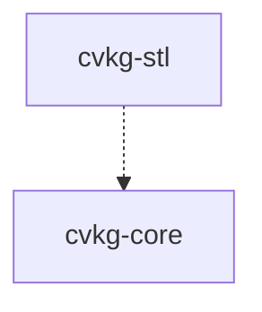

# cvkg-stl

STL file parser — binary and ASCII formats, zero external dependencies.

## Purpose

Parses both binary and ASCII STL files, auto-detects format, and produces indexed mesh data (`StlMesh`) compatible with `cvkg_core::Mesh`. No external dependencies — pure Rust.

## Boundaries

This crate does NOT:
- Render anything (no GPU code)
- Handle glTF, OBJ, or other formats (that's `cvkg-gltf` or external crates)
- Perform mesh optimization or repair (no welding, no normal recalculation)
- Validate manifold-ness or watertight-ness

It ONLY reads STL bytes and returns triangles with normals.

## Dependency graph



Dashed = compatibility only (StlMesh → Mesh conversion is manual). No actual Cargo dependency.

## Public API overview

### Types

- `StlFormat` — `Binary` | `Ascii`
- `StlMesh` — Parsed output
  - `triangles: Vec<StlTriangle>` — Each with `normal: [f32; 3]`, `vertices: [[f32; 3]; 3]`
  - `byte_count: usize` — Source file size
  - `format: StlFormat` — Detected format
- `StlTriangle` — Single triangle
  - `normal: [f32; 3]` — Face normal (from file, not recomputed)
  - `vertices: [[f32; 3]; 3]` — Three vertices (x, y, z)
  - `attribute: u16` — Binary STL attribute byte count (usually 0)
- `StlError` — Error enum
  - `Io(std::io::Error)`
  - `InvalidHeader(String)` — Missing "solid" keyword or bad binary count
  - `UnexpectedEof` — Truncated file
  - `InvalidAscii(String)` — Malformed ASCII token
  - `InvalidBinary(String)` — Bad binary record

### Functions

- `parse<R: Read + Seek>(reader: R) -> Result<StlMesh, StlError>` — Auto-detects format, parses from any `Read + Seek`
- `parse_bytes(bytes: &[u8]) -> Result<StlMesh, StlError>` — Convenience wrapper for in-memory bytes
- `parse_with_hint<R: Read>(reader: R, hint: StlFormat) -> Result<StlMesh, StlError>` — Skip auto-detection, force format
- `detect_format(reader: &mut dyn Read) -> Result<StlFormat, StlError>` — Peek at first bytes to guess format

### Module structure (internal)

- `ascii` — ASCII STL parser (token-based, handles "facet normal", "vertex", "endloop", "endfacet")
- `binary` — Binary STL parser (80-byte header + uint32 count + 50-byte records)
- `detect` — Format detection via header sniffing
- `normal` — Normal validation (checks if file-provided normal matches cross product)
- `error` — Error types

## Usage example

```rust
use cvkg_stl::{parse, parse_bytes, StlFormat};
use std::fs::File;

// From file (auto-detect)
let file = File::open("model.stl")?;
let mesh = parse(file)?;

println!("Format: {:?}, Triangles: {}", mesh.format, mesh.triangles.len());
for tri in &mesh.triangles {
    println!("  Normal: {:?}", tri.normal);
    println!("  Vertices: {:?}", tri.vertices);
}

// From bytes (e.g., embedded asset)
let bytes = include_bytes!("../assets/cube.stl");
let mesh = parse_bytes(bytes)?;

// Force format (skip detection)
let file = File::open("model.stl")?;
let mesh = parse_with_hint(file, StlFormat::Binary)?;
```

## Converting to cvkg-core::Mesh

```rust
use cvkg_core::Mesh;
use cvkg_stl::StlMesh;

fn stl_to_cvkg_mesh(stl: StlMesh) -> Mesh {
    let mut positions = Vec::new();
    let mut normals = Vec::new();
    let mut indices = Vec::new();

    for (i, tri) in stl.triangles.iter().enumerate() {
        let base = (i * 3) as u32;
        for v in &tri.vertices {
            positions.push([v[0], v[1], v[2]]);
            normals.push(tri.normal);
        }
        indices.extend([base, base + 1, base + 2]);
    }

    Mesh {
        positions,
        normals,
        indices: Some(indices),
        ..Default::default()
    }
}
```

## Use cases

- Loading 3D print models (STL is the de facto standard for slicers)
- Converting STL to CVKG mesh for rendering in `cvkg-render-3d`
- Simple mesh inspection tools
- Asset pipeline preprocessing

## Edge cases and limitations

- **No normal recomputation** — Uses file-provided normals. ASCII STL often omits them (zero vector); binary STL includes them but they may be unnormalized.
- **No vertex deduplication** — Each triangle has 3 unique vertices. Output is flat triangle soup; call `Mesh::compute_smooth_normals()` or weld vertices if needed.
- **Attribute byte ignored** — Binary STL's 2-byte attribute per triangle is read but not exposed beyond `StlTriangle::attribute`.
- **ASCII parser** — Strict; requires "solid", "facet normal", "outer loop", "vertex", "endloop", "endfacet", "endsolid" keywords. No support for comments or non-standard whitespace.
- **File size** — Entire file read into memory for ASCII (tokenization). Binary uses streaming but still collects all triangles.
- **No units** — STL has no unit metadata. Caller must know if source is mm, inches, or meters.

## Build flags / features

No Cargo features. Zero dependencies (not even `cvkg-core`).