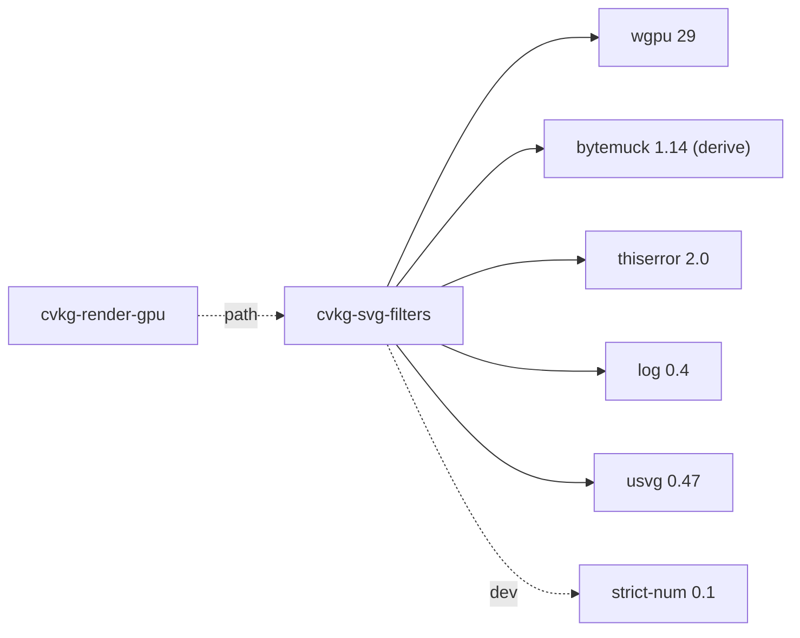

# cvkg-svg-filters

WGPU-based SVG filter primitive evaluation. Parses `usvg::filter::Filter` into a directed acyclic graph of filter primitives, then evaluates each primitive as a WGPU render or compute pass.

## Boundaries

This crate owns:

- Parsing `usvg::filter::Filter` into a `FilterGraph` (DAG of `FilterNode`s)
- Validating filter primitive chains
- Allocating and recycling GPU resources for intermediate filter results
- Recording and executing WGPU passes for each primitive
- Collecting diagnostics and benchmark data during evaluation

This crate does **not**:

- Parse SVG documents (that is `usvg`'s responsibility)
- Manage swapchains, surfaces, or presentation
- Compose filter results into a final scene (consumers read `FilterResult` from `FilterEngine`)

## Dependency graph



`cvkg-render-gpu` is the only consumer and depends on this crate via a path dependency, not through the workspace.

## Public API overview

All modules are re-exported at the crate root. The key types are:

| Module | Key types / structs | Purpose |
|---|---|---|
| `types` | `FilterError`, `GpuContext`, `FilterContext`, `FilterResult`, `ResolvedInput`, `FilterUnits`, `AlphaMode`, `FilterLod`, `SourceBackdrop` | Core types and error definitions |
| `graph` | `FilterNode`, `FilterInput`, `FilterGraph` | DAG representation of a filter chain |
| `pool` | `TransientFilterPool`, `FilterResource`, `FilterResourcePlan`, `FilterPlanner` | GPU resource allocation and recycling for intermediate results |
| `validators` | `LightingValidator`, `TurbulenceValidator`, `GlassCompatReference`, `KerningValidator`, `BrowserParityValidator` | Per-primitive validation and browser-parity checks |
| `diagnostics` | `DiagnosticSeverity`, `FilterDiagnostic`, `FilterDiagnostics`, `FilterNodeView`, `FilterEdgeView`, `FilterGraphView` | Diagnostic reporting and graph introspection |
| `heatmap` | `HeatmapLod`, `HeatmapAggregation` | Heatmap-based profiling of filter evaluation |
| `benchmark` | `FilterBenchmarkConfig`, `FilterBenchmarkResult`, `FilterBenchmark` | Benchmarking harness for filter passes |
| `engine` | `FilterEngine` | Top-level engine that drives graph evaluation on WGPU |
| `pipeline` | (internal pipeline definitions) | WGPU pipeline setup for each filter primitive kind |

## Usage example

```rust
use cvkg_svg_filters::{
    types::{FilterError, GpuContext, FilterContext, FilterResult},
    graph::FilterGraph,
    engine::FilterEngine,
};

// 1. Parse a usvg::filter::Filter into a FilterGraph
//    (usvg produces the Filter from SVG <filter> elements)
// let graph = FilterGraph::from_usvg(&usvg_filter, &usvg_tree)?;

// 2. Create the engine with a GpuContext (device + queue)
// let mut engine = FilterEngine::new(gpu_context)?;

// 3. Evaluate the graph, producing a FilterResult
// let result: FilterResult = engine.evaluate(&graph, &filter_context)?;
```

Typical call sequence:

1. `FilterGraph::from_usvg` — converts `usvg::filter::Filter` into a validated DAG.
2. `FilterEngine::new` — allocates internal WGPU resources.
3. `FilterEngine::evaluate` — records and submits WGPU passes for every node in topological order, returns the final `FilterResult`.

## Use cases

- Rendering SVG `<filter>` effects (blur, drop-shadow, color-matrix, etc.) on GPU
- Validating filter chains for browser compatibility before execution
- Profiling and benchmarking individual filter primitives in a complex chain
- Debugging filter graphs via diagnostic views and heatmap overlays

## Edge cases and limitations

- **Unsupported primitives**: If `usvg` produces a filter primitive kind that has no corresponding WGPU pipeline, evaluation returns a `FilterError`.
- **Cyclic references**: The graph is validated as a DAG; cycles are rejected during construction.
- **Resource exhaustion**: Large filter chains with many intermediate results may exhaust GPU memory. The `TransientFilterPool` mitigates this through resource recycling, but extremely wide graphs can still OOM.
- **usvg version coupling**: This crate targets `usvg 0.47`. A breaking change in `usvg::filter::Kind` or related types will require an update.
- **No async**: All evaluation is synchronous from the caller's perspective; WGPU submission happens within `evaluate`.

## Build flags / features / environment variables

This crate has **no Cargo features**, **no required environment variables**, and **no conditional compilation flags**. It builds with a standard `cargo build`.
