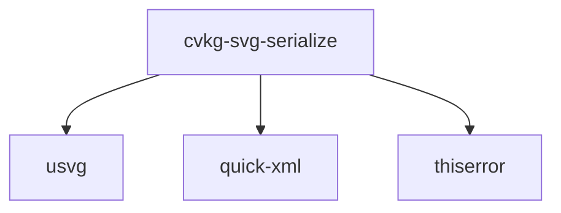

# cvkg-svg-serialize

## Purpose

Serializes a `usvg::Tree` to SVG XML. Wraps `quick-xml` for writing and provides configurable output through `SerializerConfig`, an interceptor mechanism (`SvgInterceptor`) for injecting custom attributes, styles, and child payloads, and free functions for one-shot serialization.

## Boundaries

This crate only handles SVG XML serialization. It does not parse SVG (that is `usvg`'s responsibility), does not render to raster, and does not perform layout. It accepts a fully resolved `usvg::Tree` and produces an SVG XML string or writes one to an `std::io::Writer`.

No other crate in the CVKG workspace depends on this crate directly.

## Dependency graph



| Dependency | Version | Role |
|---|---|---|
| `usvg` | 0.47 | Input tree type (`usvg::Tree`, `usvg::Node`, paint types, etc.) |
| `quick-xml` | 0.40 | XML writer with indent support |
| `thiserror` | 2.0 | Error type derive macro |

## Public API overview

### Types

| Type | Kind | Description |
|---|---|---|
| `SvgSerializeError` | enum | Error variants: `WriteError(String)`, `Io(std::io::Error)`, `Oversize { max: usize, actual: usize }` |
| `SerializerConfig` | struct | Configuration: `indent`, `inline_style`, `decimal_places`, `write_svg_declaration`, `custom_namespaces`, `comments`, `max_output_size`, `id_prefix`, `use_single_quote` |
| `SerializationStats` | struct | Post-serialize stats: `element_count`, `attribute_count`, `generated_ids`, `xml_size_bytes` |
| `SvgSerializer<'a>` | struct | Main serializer; builder-style with `with_config`, `with_interceptor` |
| `SvgInterceptor` | trait | Extension point: `global_styles()`, `inject_attributes(id)`, `inject_children(id)` |
| `SerializableNode` | trait | Maps `usvg::Node` variants to SVG attributes and children |
| `IdTracker` | struct | Detects and resolves ID collisions by appending `_1`, `_2`, … |

### Free functions

| Function | Signature | Description |
|---|---|---|
| `serialize_svg` | `(&usvg::Tree) -> Result<String, SvgSerializeError>` | One-shot serialize with defaults |
| `serialize_svg_with_config` | `(&usvg::Tree, SerializerConfig) -> Result<String, SvgSerializeError>` | One-shot serialize with custom config |
| `serialize_svg_to_file` | `(&usvg::Tree, &Path) -> Result<(), SvgSerializeError>` | Serialize directly to a file path |
| `format_svg_float` | `(f32, usize) -> String` | Format a float with trailing-zero removal and scientific notation for extreme values |
| `format_svg_color` | `(&usvg::Color, usvg::Opacity) -> String` | Format as `#rrggbb` or `#rrggbbaa` |
| `format_svg_transform` | `(&usvg::Transform) -> String` | Format as `matrix(…)` or empty string for identity |
| `fill_to_svg_attrs` | `(&usvg::Fill) -> Vec<(&str, String)>` | Convert fill paint, opacity, and rule to attribute pairs |
| `stroke_to_svg_attrs` | `(&usvg::Stroke) -> Vec<(&str, String)>` | Convert stroke paint, opacity, width, linecap, linejoin, miterlimit, dasharray to attribute pairs |
| `blend_mode_to_svg` | `(usvg::BlendMode) -> String` | Map blend mode to SVG string |
| `clip_path_to_svg_attrs` | `(&usvg::ClipPath) -> Vec<(&str, String)>` | Convert clip path to `clip-path` attribute |
| `mask_to_svg_attrs` | `(&usvg::Mask) -> Vec<(&str, String)>` | Convert mask to `mask` and optional `mask-type` attributes |

### Constants

| Constant | Type | Description |
|---|---|---|
| `VERSION` | `&str` | Crate version from `CARGO_PKG_VERSION` |

## Usage example

```rust
use cvkg_svg_serialize::{
    SerializerConfig, SvgSerializer, SvgInterceptor, serialize_svg,
};
use std::collections::HashMap;

// One-shot with defaults
let tree = usvg::Tree::from_str(
    r#"<svg xmlns="http://www.w3.org/2000/svg" width="100" height="100">
        <rect width="100" height="100" fill="red"/>
    </svg>"#,
    &usvg::Options::default(),
)
.unwrap();

let svg = serialize_svg(&tree).unwrap();
println!("{svg}");

// Custom configuration
let config = SerializerConfig {
    indent: 4,
    decimal_places: 2,
    write_svg_declaration: false,
    ..Default::default()
};
let svg = cvkg_svg_serialize::serialize_svg_with_config(&tree, config).unwrap();

// With interceptor for UI metadata injection
struct UiInterceptor;
impl SvgInterceptor for UiInterceptor {
    fn global_styles(&self) -> Option<String> {
        Some(".root { font-family: sans-serif; }".into())
    }
    fn inject_attributes(&self, id: &str) -> Vec<(&'static str, String)> {
        if id == "btn" { vec![("data-interactive", "true".into())] } else { vec![] }
    }
    fn inject_children(&self, _id: &str) -> Option<String> { None }
}

let mut serializer = SvgSerializer::new()
    .with_interceptor(Box::new(UiInterceptor));
let svg = serializer.serialize(&tree).unwrap();
println!("stats: {}", serializer.stats());
```

## Use cases

- Exporting a `usvg::Tree` to an SVG file for download or disk persistence.
- Generating SVG strings for embedding in HTML or `foreignObject` payloads.
- Injecting framework-specific metadata (`data-*` attributes, CSS animations, custom namespaces) into serialized SVG via `SvgInterceptor`.
- Controlling output size and precision for bandwidth-constrained environments (`max_output_size`, `decimal_places`).
- Resolving ID collisions when merging multiple SVG sub-trees with `IdTracker`.

## Edge cases and limitations

- **Node types**: Only `Group`, `Path`, `Image`, and `Text` nodes are serialized. `usvg::Node::Text` is treated as a leaf (children are not recursed).
- **Element count stats**: `element_count` is estimated by counting `</` substrings in the output XML, which may differ from the actual DOM element count if that sequence appears in text content.
- **ID prefixing**: `id_prefix` is applied during serialization but `IdTracker::register` is a separate utility; using both simultaneously may produce double-prefixed IDs.
- **Oversize check**: The size check happens after the full XML string is built in memory; it does not prevent allocation for large trees.
- **Float formatting**: Values with absolute magnitude below `1e-6` or above `1e6` are formatted in scientific notation regardless of `decimal_places`.
- **Custom namespaces**: Only applied to the root `<svg>` element; they are not propagated to child elements.
- **`inline_style` and `use_single_quote`**: These config fields exist but the current implementation does not use them in serialization output.
- **`comments`**: This config field exists but the current implementation does not emit XML comments.

## Build flags / features / env vars

This crate has no Cargo features, no required build flags, and no environment variables that affect compilation or runtime behavior.
