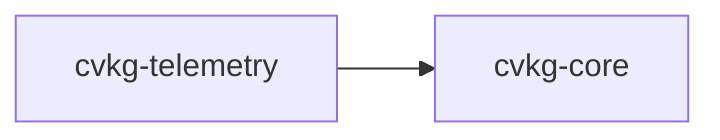

# cvkg-telemetry

Opt-in, compile-time feature-gated telemetry for accessibility and performance metrics. All data is logged locally to stderr. No data is transmitted externally.

## Boundaries

This crate only collects and summarizes telemetry events. It does not:

- Transmit data over the network
- Persist events to disk
- Configure logging backends
- Enforce accessibility or performance fixes

Downstream crates are responsible for calling `record()` / `record_frame()` at the appropriate points and acting on the results of `log_summary()`.

## Dependency graph



No other workspace crates depend on `cvkg-telemetry`.

## Public API overview

### Types

| Type | Kind | Description |
|---|---|---|
| `TelemetryEvent` | `enum` | An accessibility or performance observation. |
| `Telemetry` | `struct` | Collects and summarizes `TelemetryEvent` values. |

### `TelemetryEvent` variants

| Variant | Fields | Category |
|---|---|---|
| `ContrastFailure` | `element: String`, `apca_lc: f32`, `foreground: [f32; 4]`, `background: [f32; 4]` | Accessibility |
| `ReducedTransparencyEnabled` | — | Accessibility |
| `ReducedMotionEnabled` | — | Accessibility |
| `FrameBudgetExceeded` | `frame_time_ms: f32`, `budget_ms: f32` | Performance |
| `GlassElementRendered` | `blur_radius: f32`, `rect_area: f32` | Informational |
| `SmallTouchTarget` | `element: String`, `width: f32`, `height: f32` | Accessibility |
| `FocusRingInvisible` | `element: String`, `contrast: f32` | Accessibility |

### `TelemetryEvent` methods

- `fn description(&self) -> String` — human-readable summary
- `fn is_accessibility_issue(&self) -> bool` — true for contrast, motion, transparency, touch-target, and focus-ring variants
- `fn is_performance_issue(&self) -> bool` — true only for `FrameBudgetExceeded`

### `Telemetry` methods

| Method | Signature | Description |
|---|---|---|
| `new` | `fn new() -> Self` | Creates an empty collector. Implements `Default`. |
| `record` | `fn record(&mut self, event: TelemetryEvent)` | Stores an event and updates internal counters. |
| `record_frame` | `fn record_frame(&mut self, frame_time_ms: f32)` | Increments frame count; emits `FrameBudgetExceeded` if `frame_time_ms > 16.0`. |
| `event_count` | `fn event_count() -> usize` | Total events stored. |
| `frame_count` | `fn frame_count() -> u64` | Total frames recorded. |
| `glass_element_count` | `fn glass_element_count() -> u64` | Count of `GlassElementRendered` events. |
| `contrast_failure_count` | `fn contrast_failure_count() -> u64` | Count of `ContrastFailure` events. |
| `budget_exceeded_count` | `fn budget_exceeded_count() -> u64` | Count of `FrameBudgetExceeded` events. |
| `events` | `fn events() -> &[TelemetryEvent]` | Slice of all recorded events. |
| `accessibility_events` | `fn accessibility_events() -> Vec<&TelemetryEvent>` | Filters to accessibility issues. |
| `performance_events` | `fn performance_events() -> Vec<&TelemetryEvent>` | Filters to performance issues. |
| `elapsed_secs` | `fn elapsed_secs() -> f32` | Seconds since creation. |
| `average_fps` | `fn average_fps() -> f32` | `frame_count / elapsed_secs`. |
| `log_summary` | `fn log_summary(&self)` | Prints a summary to stderr. |
| `clear` | `fn clear(&mut self)` | Removes all events (counters are **not** reset). |

### Macros

| Macro | Expansion |
|---|---|
| `telemetry!($tel, $event)` | `$tel.record($event)` when `telemetry` feature is on; no-op otherwise. |
| `telemetry_frame!($tel, $frame_time_ms)` | `$tel.record_frame($frame_time_ms)` when `telemetry` feature is on; no-op otherwise. |

## Usage example

```rust
use cvkg_telemetry::{Telemetry, TelemetryEvent};

let mut tel = Telemetry::new();

tel.record(TelemetryEvent::ContrastFailure {
    element: "sidebar_title".into(),
    apca_lc: 42.0,
    foreground: [1.0, 1.0, 1.0, 1.0],
    background: [0.1, 0.1, 0.12, 1.0],
});

tel.record(TelemetryEvent::ReducedMotionEnabled);

tel.record_frame(20.0); // exceeds 16 ms budget

tel.log_summary();
```

When the `telemetry` feature is disabled, the macros compile to no-ops and the `Telemetry` struct methods still exist but the macros are the recommended insertion point for zero-cost opt-out.

## Use cases

- Detect APCA contrast regressions during development by checking `contrast_failure_count()`.
- Track frame-time budget overruns in glass-heavy UI regions.
- Audit touch-target sizes against the 44×44 minimum.
- Log a session summary at shutdown to identify accumulated accessibility issues.
- Gate telemetry behind the feature flag in release builds to eliminate overhead.

## Edge cases and limitations

- `clear()` empties the event vec but does **not** reset `frame_count`, `glass_element_count`, `contrast_failure_count`, or `budget_exceeded_count`.
- `average_fps()` returns `0.0` if called immediately (elapsed time ≈ 0).
- `record_frame()` hardcodes the 16 ms budget; it is not configurable.
- Events are stored in a `Vec` with no upper bound — long-running sessions will accumulate memory.
- The crate has no async support; all methods are synchronous.
- `log_summary` writes to stderr only; there is no pluggable logger.

## Build flags / features / env vars

| Feature | Default | Effect |
|---|---|---|
| `telemetry` | off | Enables the `telemetry!` and `telemetry_frame!` macros to call `record()` / `record_frame()`. When off, macros are no-ops. |

No environment variables are read by this crate.

Enable in `Cargo.toml`:

```toml
[dependencies]
cvkg-telemetry = { path = "../cvkg-telemetry", features = ["telemetry"] }
```
