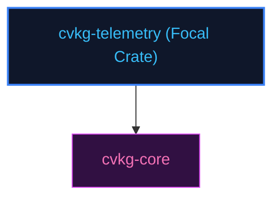

# cvkg-telemetry

## Purpose
Aggregates performance statistics, input latency tracks, and frame duration metrics.

## Boundaries
- It does not render dashboard layouts or draw visual diagrams.
- It does not contain testing frameworks; quality checks are managed by `cvkg-test`.

## Dependency Graph


## Public API Overview
- `TelemetryClient` — Performance client tracker.
- `InputLatencyTracker` — Input percentile calculator.

## Usage Example
```rust
use cvkg_telemetry::TelemetryClient;
```

## Use Cases
- Mapped as a core component inside the standard framework dependency tree.

## Edge Cases and Limitations
- Under extreme scale or thread contention, ensure the host runtime balances cycles appropriately.

## Crate-Specific Build Flags
This crate has no custom feature flags or compile-time options. It compiles under standard cargo parameters.
