# cvkg-test

## Purpose
Visual regression comparison tests and automated testing suite assertions.

## Boundaries
- It does not build release distribution assets.
- It does not contain testing frameworks; quality checks are managed by `cvkg-test`.

## Dependency Graph

```mermaid
graph TD
    cvkg-test["cvkg-test (Focal Crate)"]
    cvkg-core["cvkg-core"]
    cvkg-test --> cvkg-core
    cvkg-render-gpu["cvkg-render-gpu"]
    cvkg-test --> cvkg-render-gpu
    cvkg-macros["cvkg-macros"]
    cvkg-test --> cvkg-macros
    cvkg-components["cvkg-components"]
    cvkg-test --> cvkg-components
    cvkg-layout["cvkg-layout"]
    cvkg-test --> cvkg-layout
    cvkg-vdom["cvkg-vdom"]
    cvkg-test --> cvkg-vdom
    cvkg-scene["cvkg-scene"]
    cvkg-test --> cvkg-scene
    cvkg-anim["cvkg-anim"]
    cvkg-test --> cvkg-anim
    cvkg-flow["cvkg-flow"]
    cvkg-test --> cvkg-flow
    cvkg-runic-text["cvkg-runic-text"]
    cvkg-test --> cvkg-runic-text
    classDef focal fill:#0f172a,stroke:#3b82f6,color:#38bdf8,stroke-width:2px
    classDef sibling fill:#311042,stroke:#d946ef,color:#f472b6,stroke-width:1px
    class cvkg-test focal
    class cvkg-vdom,cvkg-core,cvkg-runic-text,cvkg-scene,cvkg-macros,cvkg-anim,cvkg-flow,cvkg-components,cvkg-render-gpu,cvkg-layout sibling
```


## Public API Overview
- `VisualComparator` — Compare image buffers.

## Usage Example
```rust
use cvkg_test::VisualComparator;
```

## Use Cases
- Mapped as a core component inside the standard framework dependency tree.

## Edge Cases and Limitations
- Under extreme scale or thread contention, ensure the host runtime balances cycles appropriately.

## Crate-Specific Build Flags
This crate has no custom feature flags or compile-time options. It compiles under standard cargo parameters.
