# cvkg-test

## Purpose

Automated visual regression testing harness for CVKG. Provides pixel-level image comparison, golden image snapshot testing, backend conformance suites (all backends must produce identical output for identical input), and accessibility conformance validation against platform protocols (UIAutomation, VoiceOver, AT-SPI, ARIA).

## Boundaries

This crate is a **test harness only** — it is not intended for production use (`publish = false`). It compares rendered pixel output; it does not render anything itself. Rendering is done by `cvkg-render-gpu` and other backends. This crate depends on those backends to produce frames, then validates the results.

Reverse dependents: none in the workspace. Other crates pull in `cvkg-test` as a dev-dependency when they need visual or accessibility conformance tests.

## Dependency graph

```mermaid
graph TD
    cvkg-test --> cvkg-core
    cvkg-test --> cvkg-render-gpu
    cvkg-test --> cvkg-runic-text
    cvkg-test --> image
    cvkg-test --> bytemuck
    cvkg-test --> pollster
    cvkg-test --> log
    cvkg-test --> env_logger
    cvkg-test --> tokio

    cvkg-test -.->|dev| cvkg-macros
    cvkg-test -.->|dev| cvkg-components
    cvkg-test -.->|dev| cvkg-layout
    cvkg-test -.->|dev| cvkg-vdom
    cvkg-test -.->|dev| cvkg-scene
    cvkg-test -.->|dev| cvkg-anim
    cvkg-test -.->|dev| cvkg-flow
    cvkg-test -.->|dev| walkdir
    cvkg-test -.->|dev| serde_json
    cvkg-test -.->|dev| insta
    cvkg-test -.->|dev| proptest
    cvkg-test -.->|dev| arbitrary
    cvkg-test -.->|dev| libfuzzer-sys
    cvkg-test -.->|dev| glam
```



## Public API overview

### `VisualComparator`

```rust
pub struct VisualComparator {
    pub pixel_tolerance: f32,          // 0.0 to 1.0, default 0.01
    pub total_tolerance_percent: f32,  // 0.0 to 100.0, default 0.05
}
```

- `VisualComparator::default()` — tolerance 0.01 per pixel, 0.05% total.
- `fn compare(&self, img1: &[u8], img2: &[u8]) -> f32` — compares two RGBA pixel buffers. Returns the percentage of pixels that differ beyond `pixel_tolerance`. Returns `100.0` if buffer sizes differ, `0.0` if both are empty. Only R, G, B channels are compared; alpha is ignored.

### `GoldenImage`

```rust
pub struct GoldenImage {
    pub name: String,
}
```

- `fn new(name: &str) -> Self`
- `fn assert_match(&self, width: u32, height: u32, pixels: &[u8])` — compares `pixels` against a PNG on disk at `tests/snapshots/<name>.png`. If the file is missing or `UPDATE_GOLDEN=1`, writes the new image. Otherwise asserts that the difference is below 0.01%.

### Backend Conformance (`conformance` module)

- `ConformanceTest { name: &'static str, run: fn() -> ConformanceResult }` — a single test case.
- `ConformanceResult { pixels: Vec<u8>, width: u32, height: u32 }` — pixel output of a test.
- `ConformanceSuite` — registry of `ConformanceTest` items.
  - `fn new() -> Self`
  - `fn register(&mut self, test: ConformanceTest)`
  - `fn run_all(&self) -> Vec<(&'static str, bool)>`
  - `fn len(&self) -> usize` / `fn is_empty(&self) -> bool`
- `fn pixels_match(a: &[u8], b: &[u8]) -> bool` — strict byte-for-byte equality.
- `fn pixels_approx_match(a: &[u8], b: &[u8], tolerance: u8) -> bool` — per-byte tolerance for floating-point rounding differences.

### Accessibility Conformance (`a11y_conformance` module)

- `A11yProtocol` — enum: `UIAutomation`, `VoiceOver`, `AtSpi`, `ARIA`.
  - `fn all() -> &'static [A11yProtocol]`
  - `fn supports_live_regions(&self) -> bool` — all four return `true`.
  - `fn supports_custom_actions(&self) -> bool` — only `UIAutomation` and `VoiceOver` return `true`.
- `A11yRole` — enum of 20 accessibility roles (`Button`, `Checkbox`, `Radio`, `Slider`, `TextInput`, `Label`, `Heading`, `Link`, `List`, `ListItem`, `Table`, `Row`, `Cell`, `Tree`, `TreeItem`, `Dialog`, `Menu`, `MenuItem`, `Tab`, `TabPanel`, `ProgressBar`, `Unknown`).
- `RoleMapping { role: A11yRole, protocol_role: HashMap<A11yProtocol, &'static str> }` with builder methods `new()`, `with_protocol()`, `for_protocol()`.
- `A11yConformanceTest { name: &'static str, role: A11yRole, expected: HashMap<A11yProtocol, &'static str> }`.
- `A11yConformanceSuite` — registry of `A11yConformanceTest` items.
  - `fn new() -> Self`
  - `fn register(&mut self, test: A11yConformanceTest)`
  - `fn run_all(&self) -> Vec<(&str, bool)>`
- `A11yValidator` — static validation methods:
  - `fn validate_accessible_names(node_names: &HashMap<u64, String>, interactive_nodes: &[u64]) -> Vec<u64>` — returns IDs of interactive nodes missing accessible names.
  - `fn validate_heading_levels(levels: &[u64]) -> bool` — checks that heading levels start at 1 or 2 and never skip a level.
  - `fn validate_form_labels(form_fields: &[u64], labels: &HashMap<u64, Vec<u64>>) -> Vec<u64>` — returns field IDs without associated labels.

## Usage example

```rust
use cvkg_test::{VisualComparator, GoldenImage};

// Direct pixel comparison
let comp = VisualComparator::default();
let diff = comp.compare(&pixels_a, &pixels_b);
assert!(diff < 0.1, "images differ by {diff}%");

// Custom tolerance
let strict = VisualComparator {
    pixel_tolerance: 0.0,
    total_tolerance_percent: 0.0,
};
assert_eq!(strict.compare(&pixels_a, &pixels_a), 0.0);

// Golden image snapshot
let golden = GoldenImage::new("button_default");
golden.assert_match(128, 64, &rendered_pixels);
// First run or UPDATE_GOLDEN=1 writes tests/snapshots/button_default.png
// Subsequent runs compare against that file
```

## Use cases

- **Visual regression testing**: render a UI component, compare its pixel output against a known-good reference. Catch unintended rendering changes before they reach production.
- **Cross-backend conformance**: register the same scene description as a `ConformanceTest` for each backend (GPU, software). Run `ConformanceSuite::run_all()` to verify all backends produce identical pixels.
- **Accessibility audit**: use `A11yConformanceSuite` to verify that CVKG's internal role mappings match platform protocol expectations. Use `A11yValidator` to check runtime accessibility trees for missing names, bad heading structure, and unlabeled form fields.
- **Property-based testing**: combine `proptest` / `arbitrary` (available as dev-deps) with `VisualComparator::compare()` to fuzz scene graphs and assert that rendering is deterministic.
- **Fuzz testing**: `libfuzzer-sys` is available as a dev-dependency for coverage-guided fuzzing of the comparison and conformance infrastructure itself.

## Edge cases and limitations

- `VisualComparator::compare` ignores the alpha channel (only checks R, G, B). Two images with identical color but different alpha will report 0% difference.
- Mismatched buffer sizes return `100.0` immediately — no partial comparison is attempted.
- Empty buffers (both sides) return `0.0` — this is a vacuous pass, not an error.
- `GoldenImage::assert_match` uses a hardcoded threshold of 0.01% — not configurable per-call. For custom tolerances, use `VisualComparator` directly.
- `ConformanceSuite::run_all` only checks that pixel output is non-empty and has the correct length. It does not compare across backends by itself — the caller must register one test per backend and compare the results.
- `A11yConformanceSuite::role_mappings` contains a fixed built-in set (Button, Checkbox, TextInput). Roles not in that set will cause tests to fail unless the suite is extended.
- `A11yValidator::validate_heading_levels` requires the first heading to be level 1 or 2. Documents starting at h3 or below will be flagged.
- `GoldenImage` writes PNG files relative to `CARGO_MANIFEST_DIR/tests/snapshots/`. In a workspace, each crate using it gets its own snapshot directory.

## Build flags / features / env vars

| Name | Type | Description |
|------|------|-------------|
| `UPDATE_GOLDEN` | env var | Set to `"1"` to update golden image files on disk instead of comparing. |
| `RUST_LOG` | env var | Standard `env_logger` filter. Controls log output from the test harness and its dependencies. |
| *(no crate features)* | — | This crate defines no `[features]` in `Cargo.toml`. All functionality is always available. |
