# cvkg-test

```mermaid
graph TD
    cvkg-core["cvkg-core"]
    cvkg-vdom["cvkg-vdom"]
    cvkg-scene["cvkg-scene"]
    cvkg-layout["cvkg-layout"]
    cvkg-render-gpu["cvkg-render-gpu"]
    cvkg-render-native["cvkg-render-native"]
    cvkg-compositor["cvkg-compositor"]
    cvkg-themes["cvkg-themes"]
    cvkg-anim["cvkg-anim"]
    cvkg-flow["cvkg-flow"]
    cvkg-runic-text["cvkg-runic-text"]
    cvkg-svg-filters["cvkg-svg-filters"]
    cvkg-svg-serialize["cvkg-svg-serialize"]
    cvkg-components["cvkg-components"]
    cvkg-macros["cvkg-macros"]
    cvkg-cli["cvkg-cli"]
    cvkg-webkit-server["cvkg-webkit-server"]
    cvkg-test["cvkg-test"]
    cvkg-physics["cvkg-physics"]
    cvkg["cvkg (umbrella)"]

    cvkg-vdom --> cvkg-core
    cvkg-vdom --> cvkg-scene
    cvkg-layout --> cvkg-core
    cvkg-layout --> cvkg-anim
    cvkg-scene --> cvkg-core

    cvkg-render-gpu --> cvkg-core
    cvkg-render-gpu --> cvkg-compositor
    cvkg-render-gpu --> cvkg-svg-filters
    cvkg-render-gpu --> cvkg-svg-serialize
    cvkg-render-gpu --> cvkg-runic-text

    cvkg-render-native --> cvkg-core
    cvkg-render-native --> cvkg-render-gpu
    cvkg-render-native --> cvkg-vdom
    cvkg-render-native --> cvkg-themes

    cvkg-compositor --> cvkg-core

    cvkg-themes --> cvkg-core
    cvkg-themes --> cvkg-anim
    cvkg-anim --> cvkg-core
    cvkg-flow --> cvkg-core
    cvkg-flow --> cvkg-scene
    cvkg-flow --> cvkg-themes

    cvkg-runic-text --> cvkg-core
    cvkg-svg-filters --> cvkg-core

    cvkg-components --> cvkg-core
    cvkg-components --> cvkg-vdom
    cvkg-components --> cvkg-layout
    cvkg-components --> cvkg-themes
    cvkg-components --> cvkg-anim
    cvkg-components --> cvkg-runic-text

    cvkg-macros --> cvkg-core
    cvkg-cli --> cvkg-core
    cvkg-cli --> cvkg-physics
    cvkg-cli --> cvkg-anim
    cvkg-cli --> cvkg-macros
    cvkg-webkit-server --> cvkg-cli
    cvkg-physics --> cvkg-core
    cvkg-physics --> cvkg-scene

    cvkg --> cvkg-core
    cvkg --> cvkg-vdom
    cvkg --> cvkg-scene
    cvkg --> cvkg-layout
    cvkg --> cvkg-themes
    cvkg --> cvkg-anim
    cvkg --> cvkg-macros
    cvkg --> cvkg-components
    cvkg --> cvkg-render-gpu
    cvkg --> cvkg-render-native
```



`cvkg-test` provides the authoritative testing utilities for the CVKG ecosystem, specializing in visual regression and high-fidelity UI validation.

## Boundaries and Responsibilities

This crate focuses on quality assurance. Its responsibilities include:
- **Visual Regression**: Comparing rendered pixel buffers to detect subtle UI changes.
- **Tolerance Management**: Allowing for configurable pixel-level and total-image difference thresholds.
- **Snapshot Infrastructure**: Providing the tools to capture and store "golden" images for CI/CD pipelines.

## Public API Overview

### Core Types
- `VisualComparator`: The primary engine for comparing RGBA pixel buffers.
- `VisualTolerance`: Configuration for individual pixel variance and total percentage change.

### Methods
- `VisualComparator::compare(img1, img2)`: Returns the percentage of pixels that differ beyond the defined tolerance.

## Usage Example

```rust
use cvkg_test::VisualComparator;

#[test]
fn test_ui_snapshot() {
    let comparator = VisualComparator {
        pixel_tolerance: 0.02,
        total_tolerance_percent: 0.1,
    };
    
    let current_frame = capture_frame();
    let golden_frame = load_golden("main_screen.png");
    
    let diff = comparator.compare(&current_frame, &golden_frame);
    assert!(diff < comparator.total_tolerance_percent, "Visual regression detected: {}% diff", diff);
}
```

## Known Limitations
- Visual testing is highly sensitive to hardware differences (GPU drivers, subpixel rendering); use the `cvkg` Docker images for consistent CI results.
- Large images (4K+) may incur significant CPU overhead during comparison.
