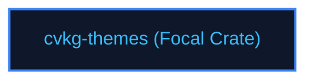

# cvkg-themes

## Purpose
OKLCH-based system token catalog managing color palettes and premium materials.

## Boundaries
- It does not shape unicode character fonts or compute text wrapping widths.
- It does not contain testing frameworks; quality checks are managed by `cvkg-test`.

## Dependency Graph


## Public API Overview
- `ThemeBuilder` — Builder for colors and tokens.
- `oklch_to_color_theme` — Conversions.

## Usage Example
```rust
use cvkg_themes::ThemeBuilder;
```

## Use Cases
- Mapped as a core component inside the standard framework dependency tree.

## Edge Cases and Limitations
- Under extreme scale or thread contention, ensure the host runtime balances cycles appropriately.

## Crate-Specific Build Flags
This crate has no custom feature flags or compile-time options. It compiles under standard cargo parameters.
