# cvkg-themes

```mermaid
graph TD
    cvkg-core["cvkg-core"]
    cvkg-vdom["cvkg-vdom"]
    cvkg-scene["cvkg-scene"]
    cvkg-layout["cvkg-layout"]
    cvkg-render-gpu["cvkg-render-gpu"]
    cvkg-render-native["cvkg-render-native"]
    cvkg-compositor["cvkg-compositor"]
    cvkg-themes["cvkg-themes"]
    cvkg-anim["cvkg-anim"]
    cvkg-flow["cvkg-flow"]
    cvkg-runic-text["cvkg-runic-text"]
    cvkg-svg-filters["cvkg-svg-filters"]
    cvkg-svg-serialize["cvkg-svg-serialize"]
    cvkg-components["cvkg-components"]
    cvkg-macros["cvkg-macros"]
    cvkg-cli["cvkg-cli"]
    cvkg-webkit-server["cvkg-webkit-server"]
    cvkg-test["cvkg-test"]
    cvkg-physics["cvkg-physics"]
    cvkg["cvkg (umbrella)"]

    cvkg-vdom --> cvkg-core
    cvkg-vdom --> cvkg-scene
    cvkg-layout --> cvkg-core
    cvkg-layout --> cvkg-anim
    cvkg-scene --> cvkg-core

    cvkg-render-gpu --> cvkg-core
    cvkg-render-gpu --> cvkg-compositor
    cvkg-render-gpu --> cvkg-svg-filters
    cvkg-render-gpu --> cvkg-svg-serialize
    cvkg-render-gpu --> cvkg-runic-text

    cvkg-render-native --> cvkg-core
    cvkg-render-native --> cvkg-render-gpu
    cvkg-render-native --> cvkg-vdom
    cvkg-render-native --> cvkg-themes

    cvkg-compositor --> cvkg-core

    cvkg-themes --> cvkg-core
    cvkg-themes --> cvkg-anim
    cvkg-anim --> cvkg-core
    cvkg-flow --> cvkg-core
    cvkg-flow --> cvkg-scene
    cvkg-flow --> cvkg-themes

    cvkg-runic-text --> cvkg-core
    cvkg-svg-filters --> cvkg-core

    cvkg-components --> cvkg-core
    cvkg-components --> cvkg-vdom
    cvkg-components --> cvkg-layout
    cvkg-components --> cvkg-themes
    cvkg-components --> cvkg-anim
    cvkg-components --> cvkg-runic-text

    cvkg-macros --> cvkg-core
    cvkg-cli --> cvkg-core
    cvkg-cli --> cvkg-physics
    cvkg-cli --> cvkg-anim
    cvkg-cli --> cvkg-macros
    cvkg-webkit-server --> cvkg-cli
    cvkg-physics --> cvkg-core
    cvkg-physics --> cvkg-scene

    cvkg --> cvkg-core
    cvkg --> cvkg-vdom
    cvkg --> cvkg-scene
    cvkg --> cvkg-layout
    cvkg --> cvkg-themes
    cvkg --> cvkg-anim
    cvkg --> cvkg-macros
    cvkg --> cvkg-components
    cvkg --> cvkg-render-gpu
    cvkg --> cvkg-render-native
```



`cvkg-themes` defines the authoritative "Berserker Design System" tokens, enabling consistent aesthetics, rhythmic typography, and accessible color palettes across the CVKG ecosystem.

## Boundaries and Responsibilities

This crate provides the data structures for design tokens. It does NOT apply styles directly (delegated to components). Its responsibilities include:
- Defining semantic color palettes (`Primary`, `Secondary`, `Accent`, `Surface`, `Background`).
- Establishing typography scales for hero headers, body text, and captions.
- Standardizing spacing and motion (animation physics) scales.
- Providing built-in themes like the default "Norse Dark" mode.
- Validating theme contrast against WCAG 2.1 accessibility standards.

## Public API Overview

### Theme Structure
- `Theme`: The root container for all design tokens.
- `SemanticColors`: Context-aware color definitions.
- `TypographyScale`: Rhythmic font sizes.
- `SpacingScale`: Standardized padding and margin values.
- `MotionScale`: Presets for Sleipnir animation solvers.

### Authoritative Tokens
- `Color::VIKING_GOLD`: The primary brand color.
- `Color::TACTICAL_OBSIDIAN`: The authoritative background for UI surfaces.
- `Color::MAGENTA_LIQUID`: The primary accent color for active states.

### Methods
- `Theme::dark()`: Returns the default high-fidelity dark theme.
- `Theme::validate_accessibility()`: Checks for contrast violations and returns a list of warnings.

## Usage Example

```rust
use cvkg_themes::Theme;

let theme = Theme::dark();
let bg_color = theme.colors.background;

// Check for accessibility compliance
for warning in theme.validate_accessibility() {
    eprintln!("A11y Warning: {}", warning);
}
```

## Known Limitations
- Dynamic runtime theme switching requires state management at the application level (typically via `EnvironmentValue`).
- Color validation is based on standard LTR contrast formulas; complex gradients require manual review.
