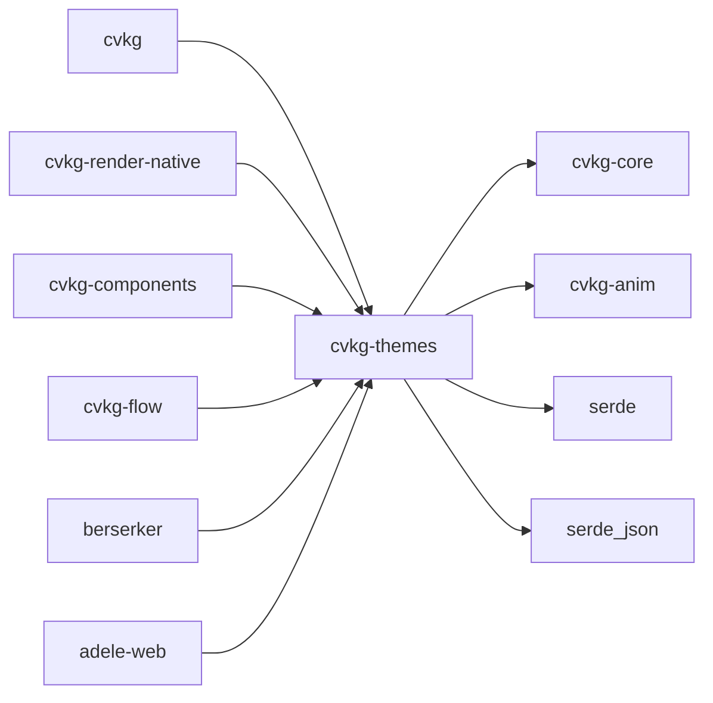

# cvkg-themes

OKLCH color model, design tokens, and theme system for the CVKG UI framework.

## Boundaries

This crate owns color science and theme data only. It does not render anything, handle layout, or manage widget state. It produces `cvkg_core::Color`, `cvkg_core::ColorTheme`, and `Theme` values that downstream crates consume.

## Dependency graph



## Public API overview

### Color model

- `OklchColor` — perceptually uniform color with fields `l`, `c`, `h`, `a` (all `f32`)
- `OklchColor::new(l, c, h, a)` — construct from components
- `OklchColor::from_rgb(r, g, b)` — convert sRGB [0,1] to OKLCH
- `OklchColor::to_rgba(&self) -> Color` — convert back to sRGB
- `OklchColor::lighten(&self, amount) -> Self`
- `OklchColor::darken(&self, amount) -> Self`
- `OklchColor::saturate(&self, amount) -> Self`
- `OklchColor::rotate_hue(&self, degrees) -> Self`
- `OklchColor::relative_luminance(&self) -> f32`

### GPU theme generation

- `oklch_to_color_theme(seed: OklchColor) -> cvkg_core::ColorTheme` — fast-path: single seed to 160-byte GPU-ready `ColorTheme` without allocating a `Theme`

### Glass material

- `GlassMaterial` — descriptor for frosted-glass surfaces (`backdrop_blur_radius`, `refraction_index`, `frost_intensity`, `tint_color`, `tint_opacity`, `border_glow_color`, `border_glow_radius`)
- `GlassMaterial::default_glass() -> Self`
- `glass_material_to_gpu_patch(mat: &GlassMaterial) -> [f32; 4]`

### Semantic colors

- `SemanticColors` — `primary`, `secondary`, `accent`, `background`, `surface`, `error`, `warning`, `success`, `text`, `text_dim` (all `Color`)

### Design token scales

- `TypographyScale` — Apple HIG text styles (`large_title` through `caption2`) plus legacy aliases (`hero`, `h1`, `h2`, `caption`, `code`)
- `RadiusScale` — `xs` (4px) through `full` (9999px), anchored to Tahoe's 12px standard
- `SpacingScale` — 4px grid: `xs` (4px) through `xxxl` (48px)
- `MotionScale` — four spring presets: `snappy`, `fluid`, `heavy`, `bouncy` (each `cvkg_anim::SpringParams`)

### Density

- `Density` enum: `Compact` (0.75x), `Default` (1.0x), `Spacious` (1.25x)
- `Density::multiplier(self) -> f32`

### Accessibility

- `AccessibilityOverrides` — `reduce_transparency`, `reduce_motion`, `increase_contrast` (all `bool`)
- `ApcaResult` — `contrast: f32`, `passes: bool`, `level: &'static str` ("fail", "large-only", "pass")
- `ApcaResult` implements `Display`

### Theme

- `Theme` — resolved theme with `colors`, `typography`, `spacing`, `radius`, `motion`, `materials`, `accessibility`, `density`, `glassmorphism_enabled`
- `Theme::dark() -> Self` — dark Norse theme, glassmorphism enabled
- `Theme::light() -> Self` — light theme, glassmorphism disabled
- `Theme::business_light() -> Self` — muted light theme, no glassmorphism
- `Theme::marketing_light() -> Self` — spacious light theme, no glassmorphism
- `Theme::from_seed(seed: OklchColor) -> Self` — derive full palette from one OKLCH color
- `Theme::toggle(&self) -> Self` — switch dark/light, preserving typography/spacing/motion
- `Theme::is_dark(&self) -> bool`
- `Theme::glassmorphism_enabled(&self) -> bool`
- `Theme::validate_accessibility(&self) -> Vec<ApcaResult>` — APCA check at 16px/400 weight
- `Theme::validate_accessibility_apca(&self, font_size_px: f32, font_weight: u16) -> Vec<ApcaResult>`

### ThemeBuilder

- `ThemeBuilder::dark()`, `ThemeBuilder::light()`, `ThemeBuilder::from_seed()`, `ThemeBuilder::from_brand_hex()`, `ThemeBuilder::from_theme()`
- `ThemeBuilder::business_light()`, `ThemeBuilder::marketing_light()`
- Color setters: `with_primary`, `with_secondary`, `with_accent`, `with_background`, `with_surface`, `with_error_color`, `with_warning_color`, `with_success_color`, `with_text`, `with_text_dim`
- Glass setters: `with_glass_blur`, `with_glass_frost`, `with_glass_tint`
- Accessibility setters: `with_reduce_transparency`, `with_reduce_motion`, `with_increase_contrast`
- Other setters: `with_glassmorphism`, `with_density`, `primary_hex`
- `ThemeBuilder::build(self) -> Theme`

### Interactive state colors

- `InteractiveState` enum: `Default`, `Hover`, `Active`, `Focus`, `Disabled`, `Error`, `Success`
- `StateColors` — per-state colors including `default`, `hover`, `active`, `focus`, `disabled`, `focus_ring`, `text`, `text_on_hover`, `text_on_active`, `error`, `success`
- `StateColors::from_base(base: OklchColor) -> Self` — auto-synthesize all states
- `StateColors::from_rgb(r, g, b) -> Self` — synthesize from sRGB
- `StateColors::color_for(&self, state: InteractiveState) -> Color`
- `StateColors::validate_contrast(&self) -> Vec<(InteractiveState, ApcaResult)>`

## Usage example

```rust
use cvkg_themes::{OklchColor, Theme, ThemeBuilder, StateColors, oklch_to_color_theme};

// Create a theme from a single brand color
let brand = OklchColor::new(0.55, 0.12, 260.0, 1.0);
let theme = Theme::from_seed(brand);

// Or use the builder for selective overrides
let custom = ThemeBuilder::from_brand_hex("#6B4CE6")
    .with_glass_blur(30.0)
    .with_density(cvkg_themes::Density::Spacious)
    .with_glassmorphism(true)
    .build();

// Validate accessibility
let results = theme.validate_accessibility();
for r in &results {
    println!("{}", r);
}

// Generate interactive button states from one color
let button_states = StateColors::from_base(OklchColor::new(0.55, 0.12, 260.0, 1.0));
let hover_color = button_states.color_for(cvkg_themes::InteractiveState::Hover);

// Fast path: seed color directly to GPU uniform
let gpu_theme = oklch_to_color_theme(brand);
// renderer.set_theme(gpu_theme);
```

## Use cases

- **Dynamic brand theming**: pass a single HEX or OKLCH color and get a complete accessible palette
- **Dark/light mode switching** with `Theme::toggle()` preserving custom scales
- **GPU theme upload** via `oklch_to_color_theme()` for real-time theme changes without heap allocation
- **Component-level interactive states** via `StateColors::from_base()` for buttons, inputs, toggles
- **Accessibility auditing** with built-in APCA contrast validation at configurable font sizes and weights
- **Glassmorphic surface configuration** via `GlassMaterial` for frosted-glass panels and neon borders
- **Density adaptation** (compact/default/spacious) for different viewport sizes or user preferences

## Edge cases and limitations

- `OklchColor::from_rgb` clamps inputs to [0.0, 1.0]; out-of-range values are silently clamped, not an error
- `OklchColor::to_rgba` clamps lightness to [0.0, 1.0], chroma to [0.0, 0.4], and alpha to [0.0, 1.0]; highly saturated OKLCH colors may lose perceptual accuracy when round-tripped through sRGB
- `StateColors::compute_contrasting_text` tries pure white then pure black; if neither meets APCA Lc >= 60, it returns the higher-contrast option without further adjustment — some mid-tone backgrounds may not achieve Lc >= 60 with either
- `Theme::toggle()` resets to the `dark()` or `light()` preset, then copies typography/spacing/motion from the current theme; it does not preserve custom colors or glass materials
- `ThemeBuilder::with_glass_blur`, `with_glass_frost`, and `with_glass_tint` mutate only the first `GlassMaterial` in the materials vec; if the vec is empty (e.g. `business_light`), these calls are no-ops
- `oklch_to_color_theme` always sets `color_space: 0` and pads `_pad0`–`_pad4` to 0.0; these fields are not configurable through this function
- APCA validation in `Theme` checks text on background, text on surface, primary on background, and text_dim on background; it does not check every possible foreground/background combination
- `OklchColor` derives `PartialEq` using exact `f32` equality; colors that differ by floating-point rounding will not be equal

## Build flags / features / env vars

This crate has no Cargo features, no conditional compilation flags, and no environment variable configuration. All functionality is always available.
