# cvkg-vdom

```mermaid
graph TD
    cvkg-core["cvkg-core"]
    cvkg-vdom["cvkg-vdom"]
    cvkg-scene["cvkg-scene"]
    cvkg-layout["cvkg-layout"]
    cvkg-render-gpu["cvkg-render-gpu"]
    cvkg-render-native["cvkg-render-native"]
    cvkg-compositor["cvkg-compositor"]
    cvkg-themes["cvkg-themes"]
    cvkg-anim["cvkg-anim"]
    cvkg-flow["cvkg-flow"]
    cvkg-runic-text["cvkg-runic-text"]
    cvkg-svg-filters["cvkg-svg-filters"]
    cvkg-svg-serialize["cvkg-svg-serialize"]
    cvkg-components["cvkg-components"]
    cvkg-macros["cvkg-macros"]
    cvkg-cli["cvkg-cli"]
    cvkg-webkit-server["cvkg-webkit-server"]
    cvkg-test["cvkg-test"]
    cvkg-physics["cvkg-physics"]
    cvkg["cvkg (umbrella)"]

    cvkg-vdom --> cvkg-core
    cvkg-vdom --> cvkg-scene
    cvkg-layout --> cvkg-core
    cvkg-layout --> cvkg-anim
    cvkg-scene --> cvkg-core

    cvkg-render-gpu --> cvkg-core
    cvkg-render-gpu --> cvkg-compositor
    cvkg-render-gpu --> cvkg-svg-filters
    cvkg-render-gpu --> cvkg-svg-serialize
    cvkg-render-gpu --> cvkg-runic-text

    cvkg-render-native --> cvkg-core
    cvkg-render-native --> cvkg-render-gpu
    cvkg-render-native --> cvkg-vdom
    cvkg-render-native --> cvkg-themes

    cvkg-compositor --> cvkg-core

    cvkg-themes --> cvkg-core
    cvkg-themes --> cvkg-anim
    cvkg-anim --> cvkg-core
    cvkg-flow --> cvkg-core
    cvkg-flow --> cvkg-scene
    cvkg-flow --> cvkg-themes

    cvkg-runic-text --> cvkg-core
    cvkg-svg-filters --> cvkg-core

    cvkg-components --> cvkg-core
    cvkg-components --> cvkg-vdom
    cvkg-components --> cvkg-layout
    cvkg-components --> cvkg-themes
    cvkg-components --> cvkg-anim
    cvkg-components --> cvkg-runic-text

    cvkg-macros --> cvkg-core
    cvkg-cli --> cvkg-core
    cvkg-cli --> cvkg-physics
    cvkg-cli --> cvkg-anim
    cvkg-cli --> cvkg-macros
    cvkg-webkit-server --> cvkg-cli
    cvkg-physics --> cvkg-core
    cvkg-physics --> cvkg-scene

    cvkg --> cvkg-core
    cvkg --> cvkg-vdom
    cvkg --> cvkg-scene
    cvkg --> cvkg-layout
    cvkg --> cvkg-themes
    cvkg --> cvkg-anim
    cvkg --> cvkg-macros
    cvkg --> cvkg-components
    cvkg --> cvkg-render-gpu
    cvkg --> cvkg-render-native
```



`cvkg-vdom` provides a stateless Virtual DOM implementation for CVKG, enabling efficient UI reconciliation and platform-independent event handling.

## Boundaries and Responsibilities

This crate manages the logical representation of the UI tree. It does NOT handle GPU rendering or physics-based animations directly. Its responsibilities include:
- Capturing the `View` hierarchy into a serializable `VNode` tree.
- Computing differences between tree states to produce `VDomPatch` sets.
- Managing the accessibility tree (ShieldWall) via AccessKit.
- Routing events (pointer, keyboard) through the hierarchy with bubbling support.

## Public API Overview

### Core Types
- `VNode`: A serializable node representing a component instance, its properties, layout, and children.
- `VDom`: The root container for the Virtual DOM state and node mappings.
- `NodeId`: A unique 64-bit identifier for every node in the tree.
- `VDomPatch`: An enum representing discrete mutations (Create, Update, Remove, Move, Replace).

### Key Systems
- `VNodeRenderer`: A specialized `Renderer` implementation that builds a `VDom` from a `View` tree.
- `EventHandlerMap`: A thread-safe registry of closures for handling UI events.

## Usage Example

```rust
use cvkg_vdom::{VDom, VNodeRenderer};
use cvkg_core::{View, Rect};

// Build a VDOM from a view
let view = MyView::new();
let rect = Rect { x: 0.0, y: 0.0, width: 800.0, height: 600.0 };
let vdom = VDom::build(&view, rect);

// Access the root node
if let Some(root_id) = vdom.root {
    let root_node = vdom.nodes.get(&root_id).unwrap();
    println!("Root component type: {}", root_node.component_type);
}
```

## Known Limitations
- VDOM updates are currently full-rebuilds by default; incremental diffing is optimized for high-frequency updates in the Surtr pipeline.
- Event handlers must be `Send + Sync` to support multi-threaded event processing.
