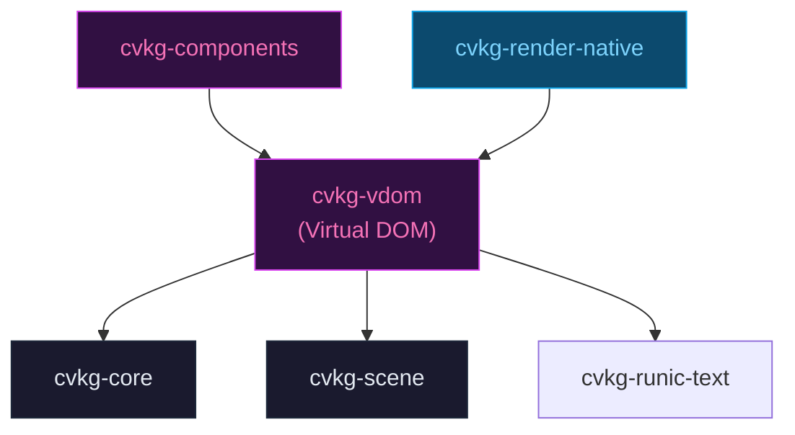

# cvkg-vdom

Stateless Virtual DOM implementation for CVKG. Manages tree diffing and node reconciliation.

## Purpose

Implements a lightweight virtual DOM that computes minimal mutation sequences between view tree states. Used by `cvkg-components` and `cvkg-render-native` to efficiently update the retained scene graph.

## Boundaries

- Does NOT own the rendering pipeline -- it produces diff commands that consumers apply to the scene graph.
- Does NOT handle layout -- spatial calculations belong to `cvkg-layout` and `cvkg-scene`.
- Not a workspace member. Depend on it directly if you need VDOM functionality outside the umbrella.

## Dependency Graph



## Public API

- `VDom` -- root container holding the node tree, parent map, focus state, and event handler map.
- `VNode` -- stateless representation of a view node (ID, properties, geometry, event handlers).
- `VDomPatch` -- mutation sequence (Create, Update, Delete, Move) computed by tree diffing.
- `VNodeRenderer` -- evaluates a composed `View` tree to populate a `VDom`.
- `AriaProps` -- ARIA attribute set for accessibility.
- `NodeId` -- type alias for `KvasirId` from `cvkg-core`.

## Usage

```rust
use cvkg_vdom::{VDom, VNodeRenderer};
use cvkg_core::View;

let renderer = VNodeRenderer::new();
let vdom = renderer.evaluate(&my_view_tree);
```

## Use Cases

- `cvkg-components` uses VDOM to diff widget trees between frames.
- `cvkg-render-native` uses VDOM to reconcile the declarative view tree with the retained scene graph.

## Edge Cases

- `body()` must be pure and side-effect free. The VDOM calls `body()` during diffing.
- Event handlers are stored in a `HashMap` keyed by node ID. Duplicate registrations overwrite.
- Focus and capture state are behind `Mutex` for thread safety.
