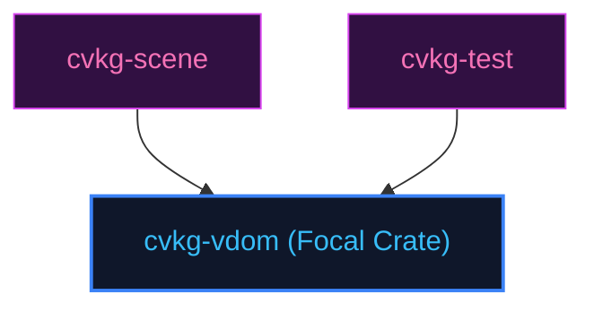

# cvkg-vdom

## Purpose
Manages Virtual DOM trees, tree diffing, and state reconciliation patches.

## Boundaries
- It does not run wgpu rendering pipelines or capture platform window events.
- It does not contain testing frameworks; quality checks are managed by `cvkg-test`.

## Dependency Graph


## Public API Overview
- `VNode` — Stateless Virtual DOM node.
- `VDom` — Hierarchy tracker.
- `VDomPatch` — Reconciler patch calculations.

## Usage Example
```rust
use cvkg_vdom::{VDom, VNode};
```

## Use Cases
- Mapped as a core component inside the standard framework dependency tree.

## Edge Cases and Limitations
- Under extreme scale or thread contention, ensure the host runtime balances cycles appropriately.

## Crate-Specific Build Flags
This crate has no custom feature flags or compile-time options. It compiles under standard cargo parameters.
