# cvkg-webkit-server

## Purpose

axum-based HTTP and WebSocket server that serves the CVKG (Cyber Viking Kvasir Graph) agentic UI framework. Provides hot-module-reload (HMR) via WebSocket broadcast, static file serving, WASM execution through Wasmtime, and a Prometheus metrics endpoint. The binary (`cvkg-webkit-server`) is the development and production host for CVKG applications.

## Boundaries

- This crate owns the HTTP layer: routing, middleware, WebSocket upgrades, CORS, compression, rate limiting, and request timeouts.
- WASM execution is handled server-side via `wasmtime` with WASI Preview 1. The public `wasm_server` module exposes `NativeWasmServer` and its session types.
- File watching for HMR is done by polling `pkg_dir`, `static_dir`, and `assets_dir` at 500 ms intervals — no inotify/fsevents dependency.
- Client-side rendering is not in scope; the server delivers the shell HTML and the HMR protocol. The browser loads WASM modules client-side.
- No reverse dependents exist in the workspace.

## Dependency graph

```mermaid
graph TD
    cvkg-webkit-server --> cvkg-cli
    cvkg-webkit-server --> wasmtime
    cvkg-webkit-server --> wasmtime-wasi
    cvkg-webkit-server --> wgpu["wgpu (optional)"]
    cvkg-webkit-server --> wry
    cvkg-webkit-server --> axum
    cvkg-webkit-server --> tokio
    cvkg-webkit-server --> tower
    cvkg-webkit-server --> tower-http
    cvkg-webkit-server --> tower_governor
    cvkg-webkit-server --> tracing
    cvkg-webkit-server --> tracing-subscriber
    cvkg-webkit-server --> serde
    cvkg-webkit-server --> serde_json
    cvkg-webkit-server --> clap
    cvkg-webkit-server --> dotenvy
    cvkg-webkit-server --> anyhow
    cvkg-webkit-server --> arc-swap
    cvkg-webkit-server --> bytes
    cvkg-webkit-server --> futures-util
    cvkg-webkit-server --> http-body-util
    cvkg-webkit-server --> metrics
    cvkg-webkit-server --> metrics-exporter-prometheus
    cvkg-webkit-server --> mime_guess
    cvkg-webkit-server --> validator
```



## Public API overview

The library crate (`cvkg_webkit_server`) exposes one public module:

### `wasm_server`

| Item | Kind | Description |
|---|---|---|
| `WasmSession` | struct | Holds a `Store<HostState>` and an `Instance` together so they stay in sync. |
| `HostState` | struct | Host state wrapping a `WasiP1Ctx` for WASI Preview 1. |
| `NativeWasmServer` | struct | Cloneable server-side WASM host backed by a shared `Engine` and an `Arc<Mutex<Option<WasmSession>>>`. |
| `NativeWasmServer::new()` | method | Creates a new server with fuel consumption enabled and async support disabled. |
| `NativeWasmServer::load_module(path, force_reload)` | method | Loads and instantiates a `.wasm` file. Skips reload when `force_reload` is false and a session exists. Calls `cvkg_init` if exported. Preopens only the current working directory with read-only permissions. Sets a fuel limit of 10 billion. |
| `NativeWasmServer::tick()` | method | Runs one update+render cycle by calling `cvkg_update` and `cvkg_render` if exported. Catches panics and returns them as errors. |

The binary (`src/main.rs`) is not part of the library API. It wires up the axum router, file watcher, HMR broadcast, and graceful shutdown.

## Usage example

### Running the server

```bash
# Default: binds 0.0.0.0:3000
cargo run --bin cvkg-webkit-server

# Custom bind address and directories
CVKG_BIND_ADDR=127.0.0.1:8080 \
CVKG_STATIC_DIR=./my-static \
CVKG_PKG_DIR=./my-pkg \
cargo run --bin cvkg-webkit-server
```

### Using the library

```rust
use cvkg_webkit_server::wasm_server::NativeWasmServer;
use std::path::Path;

let server = NativeWasmServer::new()?;
server.load_module(Path::new("app.wasm"), false)?;
server.tick()?;
```

### HMR WebSocket protocol

The client connects to `/hmr` and receives JSON messages:

```json
{"type": "reload", "payload": {}}
```

The server broadcasts a reload event whenever a file in `pkg_dir`, `static_dir`, or `assets_dir` is created, modified, or deleted.

### Runtime WebSocket protocol

The client connects to `/ws` and receives a handshake:

```json
{"type": "handshake", "payload": {"client": "webkit-runtime", "capabilities": ["patch", "state", "event"]}}
```

Accepted message types from the client: `Patch`, `Event`, `State` (deserialized via `cvkg_cli::WsMessage`).

## Use cases

- **Development server**: Run locally with HMR to iterate on CVKG applications without manual rebuilds.
- **Server-side WASM execution**: Execute CVKG logic natively via `NativeWasmServer` for SEO pre-rendering or headless operation.
- **Production static file host**: Serve pre-built CVKG applications with compression, rate limiting, and request timeouts.
- **Metrics collection**: Prometheus scrape endpoint for request counts and latency histograms.

## Edge cases and limitations

- WASI filesystem access is restricted to the current working directory at server start time. If the process working directory changes after startup, preopened paths will be stale.
- WASM fuel is fixed at 10 billion units per session. Modules that legitimately need more will trap. There is no per-tick refill.
- `load_module` with `force_reload: false` is a no-op when a session exists. There is no file-change detection on the WASM module itself — the caller must set `force_reload: true` explicitly.
- HMR file watching polls at 500 ms intervals. Rapid successive changes may be coalesced into a single reload event.
- The HMR broadcast channel is created with a default capacity. Slow or disconnected clients may cause broadcast sends to fail silently (logged at error level).
- `tick()` uses `catch_unwind`, which requires the WASM module to be `UnwindSafe`. Modules that poison the session store will return an error but the session is still reinserted.
- `wgpu` was removed as a dependency in 0.2.15. Rendering is handled by `cvkg-render-gpu` (which uses wgpu 29), not by this crate. The `backend-native`, `backend-wgpu`, and `backend-webgl2` features no longer exist; only `backend-wasm` remains.

## Build flags / features / env vars

### Cargo features

| Feature | Description |
|---|---|
| `backend-wasm` | No additional dependencies. Targets WASM output. |

### Environment variables (binary only)

| Variable | Default | Description |
|---|---|---|
| `CVKG_BIND_ADDR` | `0.0.0.0:3000` | Socket address to bind. |
| `CVKG_PKG_DIR` | `cvkg-webkit-server/pkg` | Directory for package artifacts. |
| `CVKG_ASSETS_DIR` | `cvkg-webkit-server/assets` | Directory for assets. |
| `CVKG_STATIC_DIR` | `cvkg-webkit-server/static` | Directory for static files. |
| `CVKG_RATE_LIMIT_RPS` | `1000` | Rate limit in requests per second. |
| `CVKG_TIMEOUT_SECS` | `30` | Request timeout in seconds. |
| `CVKG_MAX_CONCURRENT` | `100` | Maximum concurrent requests. |

All variables can also be set via CLI flags (see `--help`). CLI flags take precedence over environment variables.
