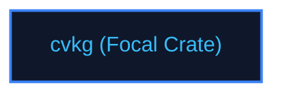

# cvkg

## Purpose
Main public facade and platform backend selector for the CVKG framework.

## Boundaries
- It does not implement renderers or layout engines directly; it delegates to platform-specific crates based on enabled features.
- It does not contain testing frameworks; quality checks are managed by `cvkg-test`.

## Dependency Graph


## Public API Overview
- `CvkgApp` — High-level application manager.
- `prelude` — Re-exports standard views, modifiers, and state macros.

## Usage Example
```rust
use cvkg::prelude::*;
fn main() {
    // Starts application facade
}
```

## Use Cases
- Mapped as a core component inside the standard framework dependency tree.

## Edge Cases and Limitations
- Under extreme scale or thread contention, ensure the host runtime balances cycles appropriately.

## Crate-Specific Build Flags
This crate has no custom feature flags or compile-time options. It compiles under standard cargo parameters.
