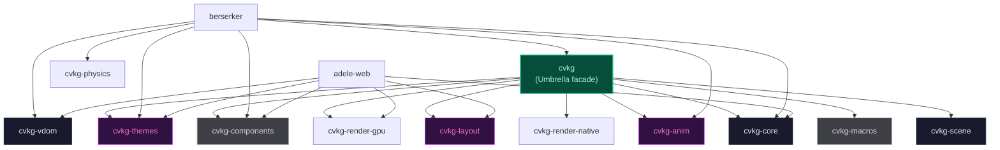

# cvkg

Umbrella facade crate for the CVKG framework. Selects the native or web backend based on feature flags.

## Purpose

Re-exports the core CVKG surface so consumers depend on a single crate. Feature flags select the rendering backend.

## Boundaries

This crate does NOT implement any rendering, layout, logic, or components. It is a facade that delegates to workspace crates.

## Dependency Graph



## Public API

The crate re-exports key types from its dependencies:

- `cvkg-core`: `View`, `Renderer`, `State`, `Binding`, `Color`, `Rect`, `KvasirId`
- `cvkg-layout`: `HStack`, `VStack`, `ZStack`, `Grid`, `TaffyLayoutEngine`
- `cvkg-anim`: `SpringParams`, `SpringSolver`, `RubberBand`
- `cvkg-components`: Full widget library
- `cvkg-themes`: `Theme`, `OklchColor`, `ThemeBuilder`

Examples: `berserker_fire_demo`, `hit_test_demo`, `shatter_demo`, `physics_3d_demo`, `declarative_dashboard`, `interactive_daw`, `daw_perf`.

## Usage

```toml
# Cargo.toml
[dependencies]
cvkg = { path = "../cvkg", features = ["native"] }
```

```rust
use cvkg::prelude::*;
use cvkg::{Color, HStack, VStack, State, View};

struct App;

impl View for App {
    type Body = VStack;
    fn body(self) -> Self::Body {
        VStack::new()
            .child(Color::RED)
            .child(Color::BLUE)
    }
}
```

## Feature Flags

| Flag | Effect |
|---|---|
| `native` | Enables `cvkg-render-native` backend |
| `gpu` | Enables `cvkg-render-gpu` |
| `web` | Enables WebGPU backend via `cvkg-render-gpu` |

## Use Cases

- Top-level application depends on `cvkg` with `features = ["native"]`.
- Library crates depend on specific sub-crates (`cvkg-core`, `cvkg-layout`, etc.) rather than the umbrella.

## Edge Cases

- Enabling both `native` and `web` simultaneously may cause conflicts. Choose one backend.
- The `gpu` and `web` features both enable `cvkg-render-gpu`. The difference is the backend integration layer.
