# cvkg

```mermaid
graph TD
    cvkg-core["cvkg-core"]
    cvkg-vdom["cvkg-vdom"]
    cvkg-scene["cvkg-scene"]
    cvkg-layout["cvkg-layout"]
    cvkg-render-gpu["cvkg-render-gpu"]
    cvkg-render-native["cvkg-render-native"]
    cvkg-compositor["cvkg-compositor"]
    cvkg-themes["cvkg-themes"]
    cvkg-anim["cvkg-anim"]
    cvkg-flow["cvkg-flow"]
    cvkg-runic-text["cvkg-runic-text"]
    cvkg-svg-filters["cvkg-svg-filters"]
    cvkg-svg-serialize["cvkg-svg-serialize"]
    cvkg-components["cvkg-components"]
    cvkg-macros["cvkg-macros"]
    cvkg-cli["cvkg-cli"]
    cvkg-webkit-server["cvkg-webkit-server"]
    cvkg-test["cvkg-test"]
    cvkg-physics["cvkg-physics"]
    cvkg["cvkg (umbrella)"]

    cvkg-vdom --> cvkg-core
    cvkg-vdom --> cvkg-scene
    cvkg-layout --> cvkg-core
    cvkg-layout --> cvkg-anim
    cvkg-scene --> cvkg-core

    cvkg-render-gpu --> cvkg-core
    cvkg-render-gpu --> cvkg-compositor
    cvkg-render-gpu --> cvkg-svg-filters
    cvkg-render-gpu --> cvkg-svg-serialize
    cvkg-render-gpu --> cvkg-runic-text

    cvkg-render-native --> cvkg-core
    cvkg-render-native --> cvkg-render-gpu
    cvkg-render-native --> cvkg-vdom
    cvkg-render-native --> cvkg-themes

    cvkg-compositor --> cvkg-core

    cvkg-themes --> cvkg-core
    cvkg-themes --> cvkg-anim
    cvkg-anim --> cvkg-core
    cvkg-flow --> cvkg-core
    cvkg-flow --> cvkg-scene
    cvkg-flow --> cvkg-themes

    cvkg-runic-text --> cvkg-core
    cvkg-svg-filters --> cvkg-core

    cvkg-components --> cvkg-core
    cvkg-components --> cvkg-vdom
    cvkg-components --> cvkg-layout
    cvkg-components --> cvkg-themes
    cvkg-components --> cvkg-anim
    cvkg-components --> cvkg-runic-text

    cvkg-macros --> cvkg-core
    cvkg-cli --> cvkg-core
    cvkg-cli --> cvkg-physics
    cvkg-cli --> cvkg-anim
    cvkg-cli --> cvkg-macros
    cvkg-webkit-server --> cvkg-cli
    cvkg-physics --> cvkg-core
    cvkg-physics --> cvkg-scene

    cvkg --> cvkg-core
    cvkg --> cvkg-vdom
    cvkg --> cvkg-scene
    cvkg --> cvkg-layout
    cvkg --> cvkg-themes
    cvkg --> cvkg-anim
    cvkg --> cvkg-macros
    cvkg --> cvkg-components
    cvkg --> cvkg-render-gpu
    cvkg --> cvkg-render-native
```



`cvkg` is the primary entry point and public facade for the Cyber Viking Kvasir Graph framework. It unifies the modular workspace crates into a single, cohesive API.

## Boundaries and Responsibilities

This crate does NOT contain implementation logic. Instead, it:
- Orchestrates the feature-gated selection of rendering backends (`gpu`, `native`, `web`).
- Re-exports core components, layout engines, and animation solvers.
- Provides a `prelude` for streamlined application development.

## Public API Overview

### Feature Flags
You MUST select exactly one rendering feature for your application:
- `gpu`: Enables direct `wgpu` rendering (Surtr).
- `native`: Enables `winit` windowing and desktop integration.
- `web`: Enables WASM/Browser deployment.

### Re-exported Modules
- `core`: Fundamental traits and types.
- `layout`: Stacking and grid containers.
- `anim`: Physics-based animation solvers.
- `components`: Reusable UI elements.
- `scene`: Retained scene graph management.
- `themes`: Semantic design tokens.

### The Prelude
```rust
use cvkg::prelude::*;
// Includes: View, State, Binding, Rect, view_component macro, etc.
```

## Usage Example

```rust
// Cargo.toml
// cvkg = { version = "0.1.18", features = ["native"] }

use cvkg::prelude::*;

#[view_component]
fn App() {
    VStack::new(20.0, Alignment::Center, Distribution::Center) {
        Text::new("Skål, Cyber Viking!")
            .gungnir([1.0, 0.5, 0.0, 1.0], 10.0, 2.0)
    }
}
```

## Known Limitations
- Mixing backend features (e.g., `native` and `web`) in a single target is unsupported and will lead to compilation conflicts.
- Always check the root README for system-level prerequisites for your chosen backend.
