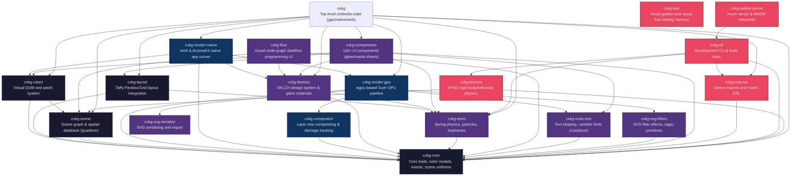

# CVKG Crate Dependency Graph

```mermaid
graph TD
    cvkg-core["cvkg-core<br/>Core traits, color models, events, scene uniforms"]
    cvkg-vdom["cvkg-vdom<br/>Virtual DOM and patch system"]
    cvkg-scene["cvkg-scene<br/>Scene graph & spatial database (quadtree)"]
    cvkg-layout["cvkg-layout<br/>Taffy Flexbox/Grid layout integration"]
    cvkg-anim["cvkg-anim<br/>Spring physics, particles, keyframes"]
    cvkg-themes["cvkg-themes<br/>OKLCH design system & glass materials"]
    cvkg-macros["cvkg-macros<br/>Derive macros and Hamr! DSL"]
    cvkg-runic-text["cvkg-runic-text<br/>Text shaping, variable fonts (rustybuzz)"]
    cvkg-svg-filters["cvkg-svg-filters<br/>SVG filter effects, wgpu primitives"]
    cvkg-svg-serialize["cvkg-svg-serialize<br/>SVG serializing and export"]
    cvkg-components["cvkg-components<br/>116+ UI components (glass/metal sheets)"]
    cvkg-render-gpu["cvkg-render-gpu<br/>wgpu-based Surtr GPU pipeline"]
    cvkg-render-native["cvkg-render-native<br/>winit & AccessKit native app runner"]
    cvkg-compositor["cvkg-compositor<br/>Layer tree compositing & damage tracking"]
    cvkg-physics["cvkg-physics<br/>XPBD rigid-body/soft-body physics"]
    cvkg-cli["cvkg-cli<br/>Development CLI & build tools"]
    cvkg-webkit-server["cvkg-webkit-server<br/>Axum server & WASM interpreter"]
    cvkg-test["cvkg-test<br/>Visual golden and visual fuzz testing harness"]
    cvkg-flow["cvkg-flow<br/>Visual node-graph dataflow programming UI"]
    cvkg["cvkg<br/>Top-level umbrella crate (gpu/native/web)"]

    cvkg-vdom --> cvkg-core
    cvkg-vdom --> cvkg-scene
    cvkg-layout --> cvkg-core
    cvkg-layout --> cvkg-anim
    cvkg-scene --> cvkg-core

    cvkg-render-gpu --> cvkg-core
    cvkg-render-gpu --> cvkg-compositor
    cvkg-render-gpu --> cvkg-svg-filters
    cvkg-render-gpu --> cvkg-svg-serialize
    cvkg-render-gpu --> cvkg-runic-text

    cvkg-render-native --> cvkg-core
    cvkg-render-native --> cvkg-render-gpu
    cvkg-render-native --> cvkg-vdom
    cvkg-render-native --> cvkg-themes

    cvkg-compositor --> cvkg-core

    cvkg-themes --> cvkg-core
    cvkg-themes --> cvkg-anim
    cvkg-anim --> cvkg-core
    cvkg-flow --> cvkg-core
    cvkg-flow --> cvkg-scene
    cvkg-flow --> cvkg-themes

    cvkg-runic-text --> cvkg-core
    cvkg-svg-filters --> cvkg-core

    cvkg-components --> cvkg-core
    cvkg-components --> cvkg-vdom
    cvkg-components --> cvkg-layout
    cvkg-components --> cvkg-themes
    cvkg-components --> cvkg-anim
    cvkg-components --> cvkg-runic-text

    cvkg-macros --> cvkg-core
    cvkg-cli --> cvkg-core
    cvkg-cli --> cvkg-physics
    cvkg-cli --> cvkg-anim
    cvkg-cli --> cvkg-macros
    cvkg-webkit-server --> cvkg-cli
    cvkg-physics --> cvkg-core
    cvkg-physics --> cvkg-scene

    cvkg --> cvkg-core
    cvkg --> cvkg-vdom
    cvkg --> cvkg-scene
    cvkg --> cvkg-layout
    cvkg --> cvkg-themes
    cvkg --> cvkg-anim
    cvkg --> cvkg-macros
    cvkg --> cvkg-components
    cvkg --> cvkg-render-gpu
    cvkg --> cvkg-render-native

    classDef core fill:#1a1a2e,stroke:#16213e,color:#e0e0e0
    classDef render fill:#0f3460,stroke:#16213e,color:#e0e0e0
    classDef ui fill:#533483,stroke:#16213e,color:#e0e0e0
    classDef infra fill:#e94560,stroke:#16213e,color:#e0e0e0

    class cvkg-core,cvkg-vdom,cvkg-scene,cvkg-layout core
    class cvkg-render-gpu,cvkg-render-native,cvkg-compositor render
    class cvkg-components,cvkg-themes,cvkg-anim,cvkg-flow,cvkg-runic-text,cvkg-svg-filters,cvkg-svg-serialize ui
    class cvkg-macros,cvkg-cli,cvkg-webkit-server,cvkg-test,cvkg-physics infra
```
