# berserker

```mermaid
graph TD
    cvkg-core["cvkg-core"]
    cvkg-vdom["cvkg-vdom"]
    cvkg-scene["cvkg-scene"]
    cvkg-layout["cvkg-layout"]
    cvkg-render-gpu["cvkg-render-gpu"]
    cvkg-render-native["cvkg-render-native"]
    cvkg-compositor["cvkg-compositor"]
    cvkg-themes["cvkg-themes"]
    cvkg-anim["cvkg-anim"]
    cvkg-flow["cvkg-flow"]
    cvkg-runic-text["cvkg-runic-text"]
    cvkg-svg-filters["cvkg-svg-filters"]
    cvkg-svg-serialize["cvkg-svg-serialize"]
    cvkg-components["cvkg-components"]
    cvkg-macros["cvkg-macros"]
    cvkg-cli["cvkg-cli"]
    cvkg-webkit-server["cvkg-webkit-server"]
    cvkg-test["cvkg-test"]
    cvkg-physics["cvkg-physics"]
    cvkg["cvkg (umbrella)"]

    cvkg-vdom --> cvkg-core
    cvkg-vdom --> cvkg-scene
    cvkg-layout --> cvkg-core
    cvkg-layout --> cvkg-anim
    cvkg-scene --> cvkg-core

    cvkg-render-gpu --> cvkg-core
    cvkg-render-gpu --> cvkg-compositor
    cvkg-render-gpu --> cvkg-svg-filters
    cvkg-render-gpu --> cvkg-svg-serialize
    cvkg-render-gpu --> cvkg-runic-text

    cvkg-render-native --> cvkg-core
    cvkg-render-native --> cvkg-render-gpu
    cvkg-render-native --> cvkg-vdom
    cvkg-render-native --> cvkg-themes

    cvkg-compositor --> cvkg-core

    cvkg-themes --> cvkg-core
    cvkg-themes --> cvkg-anim
    cvkg-anim --> cvkg-core
    cvkg-flow --> cvkg-core
    cvkg-flow --> cvkg-scene
    cvkg-flow --> cvkg-themes

    cvkg-runic-text --> cvkg-core
    cvkg-svg-filters --> cvkg-core

    cvkg-components --> cvkg-core
    cvkg-components --> cvkg-vdom
    cvkg-components --> cvkg-layout
    cvkg-components --> cvkg-themes
    cvkg-components --> cvkg-anim
    cvkg-components --> cvkg-runic-text

    cvkg-macros --> cvkg-core
    cvkg-cli --> cvkg-core
    cvkg-cli --> cvkg-physics
    cvkg-cli --> cvkg-anim
    cvkg-cli --> cvkg-macros
    cvkg-webkit-server --> cvkg-cli
    cvkg-physics --> cvkg-core
    cvkg-physics --> cvkg-scene

    cvkg --> cvkg-core
    cvkg --> cvkg-vdom
    cvkg --> cvkg-scene
    cvkg --> cvkg-layout
    cvkg --> cvkg-themes
    cvkg --> cvkg-anim
    cvkg --> cvkg-macros
    cvkg --> cvkg-components
    cvkg --> cvkg-render-gpu
    cvkg --> cvkg-render-native
```



**berserker** is the gaming/UI application built with CVKG framework featuring the Cyber Viking aesthetic.

## 🚀 Quick Start

```bash
# Run the Berserker application
cd berserker
cargo run

# Or use the CVKG CLI
cvkg run --target berserker
```

## 🎮 Features

| Feature | Description |
|---------|-------------|
| **Cyber Viking UI** | Immersive gaming interface with Norse mythology themes |
| **Real-time Effects** | Mjöllnir lightning, fire, shatter animations |
| **HUD System** | Runic text display and performance monitoring |
| **Interactive Demo** | Hit-test demo for HID validation |
| **Asset Pipeline** | Integrated theme and asset management |

## 📚 Examples

### Fire Demo

```rust
// Run the fire demo
cargo run --example berserker_fire_demo
```

### Shatter Demo

```rust
// Run the shatter demo
cargo run --example shatter_demo
```

### Hit Test Demo

```rust
// Run the hit test demo for HID validation
cargo run --example hit_test_demo
```

## 🛠️ Configuration

### Themes

Located in `themes/default.rs`:

```rust
pub struct BerserkerTheme {
    pub fire_colors: [f32; 4],
    pub ice_colors: [f32; 4],
    pub lightning_colors: [f32; 4],
}
```

### Assets

Place assets in the shared CVKG `assets/` directory at the workspace root, or under `demos/berserker/assets/` for local overrides:
- Textures
- Models
- Sounds
- Fonts

## 🎨 Customization

### Colors

```rust
use berserker::themes::BerserkerTheme;

let theme = BerserkerTheme {
    fire: [1.0, 0.3, 0.0, 1.0],    // Orange-red
    ice: [0.0, 0.8, 1.0, 1.0],     // Cyan
    lightning: [0.8, 0.8, 1.0, 1.0], // Light blue
};
```

## 📖 Related Documentation

- [cvkg-components](../cvkg-components/README.md) - UI components
- [cvkg-render-gpu](../cvkg-render-gpu/README.md) - GPU renderer
- [cvkg-cli](../cvkg-cli/README.md) - CLI tool
- [Main CVKG README](../README.md) - Project overview

## 📜 License

Mozilla Public License 2.0 - see [LICENSE](../LICENSE)
