# CVKG Crate Dependency Graph v3

```mermaid
graph TD
    cvkg-core["cvkg-core<br/>7,508 LOC<br/>View/Renderer traits<br/>ColorTheme, SceneUniforms<br/>PerformanceContract, Parallax"]
    cvkg-vdom["cvkg-vdom<br/>1,863 LOC<br/>Virtual DOM, diffing<br/>VNode, VDomPatch"]
    cvkg-scene["cvkg-scene<br/>610 LOC<br/>Scene graph, quadtree"]
    cvkg-layout["cvkg-layout<br/>1,278 LOC<br/>Taffy flexbox wrapper"]
    
    cvkg-render-gpu["cvkg-render-gpu<br/>~12,000 LOC<br/>wgpu GPU renderer<br/>Kvasir render graph<br/>⚠️ Glass pipeline broken"]
    cvkg-render-native["cvkg-render-native<br/>2,434 LOC<br/>winit + AccessKit<br/>Window management<br/>Chrome components"]
    cvkg-compositor["cvkg-compositor<br/>664 LOC<br/>Layer tree, damage<br/>Material routing"]
    
    cvkg-themes["cvkg-themes<br/>1,056 LOC<br/>OKLCH color model<br/>GlassMaterial → GPU"]
    cvkg-anim["cvkg-anim<br/>8,105+ LOC<br/>Spring physics, particles"]
    cvkg-flow["cvkg-flow<br/>2,687 LOC<br/>Node graph editor"]
    
    cvkg-runic-text["cvkg-runic-text<br/>4,877 LOC<br/>rustybuzz shaping<br/>BiDi, variable fonts"]
    cvkg-svg-filters["cvkg-svg-filters<br/>2,360 LOC<br/>17 SVG filter primitives"]
    cvkg-svg-serialize["cvkg-svg-serialize<br/>900 LOC<br/>SVG XML serialization"]
    
    cvkg-components["cvkg-components<br/>~40,000 LOC<br/>116 source files<br/>Chrome + interactive<br/>0 unwrap, 0 TODO"]
    
    cvkg-macros["cvkg-macros<br/>291 LOC<br/>#[derive(View)]<br/>hamr! DSL"]
    cvkg-cli["cvkg-cli<br/>4,470 LOC<br/>Build pipeline, dev server"]
    cvkg-webkit-server["cvkg-webkit-server<br/>693 LOC<br/>axum HTTP/WS server"]
    cvkg-test["cvkg-test<br/>130+ LOC<br/>VisualComparator<br/>Golden image testing"]
    cvkg-physics["cvkg-physics<br/>10,081 LOC<br/>GJK/EPA, XPBD<br/>GPU broadphase stub"]
    
    cvkg["cvkg<br/>top-level<br/>Features: gpu, native, web"]
    
    demo-berserker["demos/berserker<br/>Native demo"]
    demo-adele["demos/adele-web<br/>Web demo"]
    demo-niflheim["demos/niflheim-wasi<br/>WASI demo"]
    demo-berserker-fire["demos/berserker-fire-web<br/>Fire web demo"]

    cvkg-vdom --> cvkg-core
    cvkg-vdom --> cvkg-scene
    cvkg-layout --> cvkg-core
    cvkg-layout --> cvkg-anim
    cvkg-scene --> cvkg-core
    
    cvkg-render-gpu --> cvkg-core
    cvkg-render-gpu --> cvkg-compositor
    cvkg-render-gpu --> cvkg-svg-filters
    cvkg-render-gpu --> cvkg-svg-serialize
    cvkg-render-gpu --> cvkg-runic-text
    
    cvkg-render-native --> cvkg-core
    cvkg-render-native --> cvkg-render-gpu
    cvkg-render-native --> cvkg-vdom
    cvkg-render-native --> cvkg-themes
    
    cvkg-compositor --> cvkg-core
    
    cvkg-themes --> cvkg-core
    cvkg-themes --> cvkg-anim
    cvkg-anim --> cvkg-core
    cvkg-flow --> cvkg-core
    cvkg-flow --> cvkg-scene
    cvkg-flow --> cvkg-themes
    
    cvkg-runic-text --> cvkg-core
    cvkg-svg-filters --> cvkg-core
    
    cvkg-components --> cvkg-core
    cvkg-components --> cvkg-vdom
    cvkg-components --> cvkg-layout
    cvkg-components --> cvkg-themes
    cvkg-components --> cvkg-anim
    cvkg-components --> cvkg-runic-text
    
    cvkg-macros --> cvkg-core
    cvkg-cli --> cvkg-core
    cvkg-cli --> cvkg-physics
    cvkg-cli --> cvkg-anim
    cvkg-cli --> cvkg-macros
    cvkg-webkit-server --> cvkg-cli
    cvkg-physics --> cvkg-core
    cvkg-physics --> cvkg-scene
    
    cvkg --> cvkg-core
    cvkg --> cvkg-vdom
    cvkg --> cvkg-scene
    cvkg --> cvkg-layout
    cvkg --> cvkg-themes
    cvkg --> cvkg-anim
    cvkg --> cvkg-macros
    cvkg --> cvkg-components
    cvkg --> cvkg-render-gpu
    cvkg --> cvkg-render-native
    
    demo-berserker --> cvkg
    demo-berserker --> cvkg-render-native
    demo-berserker --> cvkg-components
    demo-adele --> cvkg
    demo-niflheim --> cvkg
    demo-berserker-fire --> cvkg

    classDef core fill:#1a1a2e,stroke:#16213e,color:#e0e0e0
    classDef render fill:#0f3460,stroke:#16213e,color:#e0e0e0
    classDef broken fill:#8b0000,stroke:#ff4444,color:#ffffff
    classDef ui fill:#533483,stroke:#16213e,color:#e0e0e0
    classDef infra fill:#e94560,stroke:#16213e,color:#e0e0e0
    classDef demo fill:#2d6a4f,stroke:#16213e,color:#e0e0e0
    classDef excellent fill:#1b5e20,stroke:#4caf50,color:#ffffff

    class cvkg-core,cvkg-vdom,cvkg-scene,cvkg-layout core
    class cvkg-render-gpu,cvkg-render-native,cvkg-compositor render
    class cvkg-components,cvkg-themes,cvkg-anim,cvkg-flow,cvkg-runic-text,cvkg-svg-filters,cvkg-svg-serialize ui
    class cvkg-macros,cvkg-cli,cvkg-webkit-server,cvkg-test,cvkg-physics infra
    class demo-berserker,demo-adele,demo-niflheim,demo-berserker-fire demo
    class cvkg-themes,cvkg-macros excellent
```

## Build & Test Status
- **cargo check**: PASSING (0 errors, 97 warnings)
- **cargo test**: PASSING (566+ tests, 0 failures)
- **All crate versions**: 0.2.10 (consistent)

## Known Issues (🔴 = P0, 🟠 = P1, 🟡 = P2)

### FIXED since v3:
- ✅ Glass pipeline black output -- FIXED, test_glass_pipeline_renders PASSES
- ✅ recursive_bolt() division by zero -- guarded at renderer.rs:2662
- ✅ println! in render loop -- removed

### Remaining:
- 🟠 No HDR rendering pipeline (Tahoe requires Display P3)
- 🟠 No Tahoe window chrome (transparent/borderless/custom titlebar)
- 🟠 Per-frame bind group allocation (15+/frame)
- 🟠 Accesskit version mismatch (0.22 vs 0.24)
- 🟡 Flow/compute shaders are dead code
- 🟡 Volumetric shader has no scene integration
- 🟡 i18n infrastructure not wired to components
