# Architecture

This document describes the crate topology, data flow, and design decisions of the CVKG framework.

## Crate Dependency Topology

The workspace contains 35 crates organized into tiers. Dependency flow is directed: higher-level crates depend on lower-level ones, never the reverse.

```mermaid
graph TD
    subgraph Core ["Core"]
        cvkg-core["cvkg-core<br/>(View trait, state, geometry)"]
        cvkg-scene["cvkg-scene<br/>(Scene graph, AABB culling)"]
        cvkg-spatial["cvkg-spatial<br/>(QuadTree, BVH, SpatialHash)"]
    end

    subgraph Layout ["Layout"]
        cvkg-layout["cvkg-layout<br/>(Taffy flexbox/grid)"]
        cvkg-anim["cvkg-anim<br/>(Spring physics, particles)"]
    end

    subgraph GPU ["GPU Rendering"]
        cvkg-render-gpu["cvkg-render-gpu<br/>(wgpu render graph)"]
        cvkg-compositor["cvkg-compositor<br/>(Layer tree, damage)"]
        cvkg-svg-filters["cvkg-svg-filters<br/>(GPU SVG filters)"]
        cvkg-svg-serialize["cvkg-svg-serialize<br/>(SVG write)"]
    end

    subgraph Text ["Text"]
        cvkg-runic-text["cvkg-runic-text<br/>(HarfBuzz, BiDi, wrap)"]
    end

    subgraph UI ["UI Layer"]
        cvkg-components["cvkg-components<br/>(Widgets)"]
        cvkg-themes["cvkg-themes<br/>(OKLCH tokens)"]
        cvkg-flow["cvkg-flow<br/>(Node graph editor)"]
    end

    subgraph Platform ["Platform"]
        cvkg-render-native["cvkg-render-native<br/>(winit window/events)"]
        cvkg-render-software["cvkg-render-software<br/>(CPU fallback)"]
    end

    subgraph Services ["Services"]
        cvkg-cli["cvkg-cli<br/>(Dev server, pipeline)"]
        cvkg-webkit-server["cvkg-webkit-server<br/>(axum HTTP/WS)"]
        cvkg-physics["cvkg-physics<br/>(Rigid body)"]
        cvkg-scheduler["cvkg-scheduler<br/>(Frame ordering)"]
        cvkg-test["cvkg-test<br/>(Visual regression)"]
    end

    subgraph Meta ["Meta"]
        cvkg-macros["cvkg-macros<br/>(hamr! macro)"]
        cvkg-reflect["cvkg-reflect<br/>(Type reflection)"]
        cvkg-materials["cvkg-materials<br/>(Material data)"]
        cvkg-accessibility["cvkg-accessibility<br/>(A11y tree, focus)"]
        cvkg-certification["cvkg-certification<br/>(Cross-crate tests)"]
        cvkg-telemetry["cvkg-telemetry<br/>(Metrics)"]
        cvkg-icons["cvkg-icons<br/>(Icon registry)"]
    end

    subgraph Entry ["Entry"]
        cvkg["cvkg<br/>(Umbrella facade)"]
    end

    subgraph Demos ["Demos"]
        berserker["berserker<br/>(Native HUD)"]
        adele-web["demos/adele-web<br/>(Web explorer)"]
        niflheim-web["demos/niflheim-web<br/>(WASM suite)"]
        niflheim-wasi["demos/niflheim-wasi<br/>(WASI headless)"]
        berserker-fire-web["demos/berserker-fire-web<br/>(WASM stress)"]
        cvkg-gallery["cvkg-gallery<br/>(Gallery)"]
        cvkg-game-hud["cvkg-game-hud<br/>(Game HUD)"]
        cvkg-export-raster["cvkg-export-raster<br/>(PNG/GIF export)"]
    end

    cvkg-scene --> cvkg-core
    cvkg-scene --> cvkg-spatial
    cvkg-spatial --> cvkg-core
    cvkg-layout --> cvkg-core
    cvkg-layout --> cvkg-anim
    cvkg-anim --> cvkg-core
    cvkg-render-gpu --> cvkg-core
    cvkg-render-gpu --> cvkg-compositor
    cvkg-render-gpu --> cvkg-svg-filters
    cvkg-render-gpu --> cvkg-svg-serialize
    cvkg-render-gpu --> cvkg-runic-text
    cvkg-compositor --> cvkg-core
    cvkg-runic-text --> cvkg-core
    cvkg-components --> cvkg-core
    cvkg-components --> cvkg-layout
    cvkg-components --> cvkg-themes
    cvkg-components --> cvkg-anim
    cvkg-components --> cvkg-runic-text
    cvkg-themes --> cvkg-core
    cvkg-themes --> cvkg-anim
    cvkg-flow --> cvkg-core
    cvkg-flow --> cvkg-scene
    cvkg-flow --> cvkg-themes
    cvkg-render-native --> cvkg-core
    cvkg-render-native --> cvkg-render-gpu
    cvkg-render-native --> cvkg-themes
    cvkg-render-software --> cvkg-core
    cvkg-render-software --> cvkg-runic-text
    cvkg-cli --> cvkg-core
    cvkg-cli --> cvkg-physics
    cvkg-cli --> cvkg-anim
    cvkg-cli --> cvkg-macros
    cvkg-webkit-server --> cvkg-cli
    cvkg-physics --> cvkg-core
    cvkg-physics --> cvkg-scene
    cvkg-scheduler --> cvkg-core
    cvkg-test --> cvkg-core
    cvkg-test --> cvkg-render-gpu
    cvkg-macros --> cvkg-core
    cvkg-accessibility --> cvkg-core
    cvkg-certification --> cvkg-core
    cvkg-certification --> cvkg-scene
    cvkg-telemetry --> cvkg-core
    cvkg-icons --> cvkg-core
    cvkg-icons --> cvkg-components
    cvkg --> cvkg-core
    cvkg --> cvkg-layout
    cvkg --> cvkg-themes
    cvkg --> cvkg-anim
    cvkg --> cvkg-macros
    cvkg --> cvkg-components
    berserker --> cvkg
    berserker --> cvkg-core
    berserker --> cvkg-physics
    berserker --> cvkg-anim
    berserker --> cvkg-components
    berserker --> cvkg-themes
    adele-web --> cvkg-core
    adele-web --> cvkg-render-gpu
    adele-web --> cvkg-components
    adele-web --> cvkg-themes
    niflheim-web --> cvkg-core
    niflheim-web --> cvkg-render-gpu
    niflheim-web --> cvkg-components
    niflheim-wasi --> cvkg-core
    niflheim-wasi --> cvkg-components
    berserker-fire-web --> cvkg-core
    berserker-fire-web --> cvkg-render-gpu
    cvkg-gallery --> cvkg
    cvkg-gallery --> cvkg-components
    cvkg-game-hud --> cvkg-components
    cvkg-game-hud --> cvkg-core
    cvkg-export-raster --> cvkg-render-gpu

    classDef core fill:#1a1a2e,stroke:#1e293b,color:#e2e8f0,stroke-width:1px
    classDef layout fill:#1e1b4b,stroke:#6366f1,color:#a5b4fc,stroke-width:1px
    classDef gpu fill:#0f172a,stroke:#3b82f6,color:#38bdf8,stroke-width:1.5px
    classDef text fill:#1c1917,stroke:#78716c,color:#d6d3d1,stroke-width:1px
    classDef ui fill:#311042,stroke:#d946ef,color:#f472b6,stroke-width:1px
    classDef platform fill:#0c4a6e,stroke:#0ea5e9,color:#7dd3fc,stroke-width:1px
    classDef services fill:#14532d,stroke:#22c55e,color:#86efac,stroke-width:1px
    classDef meta fill:#3f3f46,stroke:#a1a1aa,color:#d4d4d8,stroke-width:1px
    classDef entry fill:#064e3b,stroke:#10b981,color:#a7f3d0,stroke-width:2px
    classDef demo fill:#4a1d96,stroke:#a855f7,color:#c084fc,stroke-width:1.5px

    class cvkg-core,cvkg-scene,cvkg-spatial core
    class cvkg-layout,cvkg-anim layout
    class cvkg-render-gpu,cvkg-compositor,cvkg-svg-filters,cvkg-svg-serialize gpu
    class cvkg-runic-text text
    class cvkg-components,cvkg-themes,cvkg-flow ui
    class cvkg-render-native,cvkg-render-software platform
    class cvkg-cli,cvkg-webkit-server,cvkg-physics,cvkg-scheduler,cvkg-test services
    class cvkg-macros,cvkg-reflect,cvkg-materials,cvkg-accessibility,cvkg-certification,cvkg-telemetry,cvkg-icons meta
    class cvkg entry
    class berserker,adele-web,niflheim-web,niflheim-wasi,berserker-fire-web,cvkg-gallery,cvkg-game-hud,cvkg-export-raster demo
```

## Subsystems

### View Composition (cvkg-core)

The `View` trait is the fundamental building block. Every UI element implements `View` and returns a tree via `body()`. The trait requires `Send` but not `Sync`, enabling multi-threaded layout.

Key types: `View`, `Renderer`, `State<T>`, `Binding<T>`, `Color` (fields `.r`, `.g`, `.b`, `.a`), `Rect`, `KvasirId` (platform-wide unique ID), `LayoutCache`, `LayoutView`.

### Virtual DOM (cvkg-vdom)

Stateless tree diffing. `VNode` holds properties and geometry; `VDom` owns the tree; `VDomPatch` represents mutations (Create, Update, Delete, Move). Not a workspace member -- used by cvkg-components and cvkg-render-native.

### Scene Graph (cvkg-scene)

Retained visual tree with AABB culling and dirty-rect tracking. Uses `cvkg-spatial` for spatial indexing. `SceneNode` holds pre-tessellated geometry for the GPU pipeline.

### Spatial Indexing (cvkg-spatial)

Canonical `Quadtree`, `Bvh` (bounding volume hierarchy), and `SpatialHash` used across Scene, Physics, Flow, and Layout. Extracted during crosscrate audit to eliminate duplication.

### Layout (cvkg-layout)

Wraps the Taffy crate for flexbox and grid layout. `TaffyLayoutEngine` drives the solver. Containers: `HStack`, `VStack`, `ZStack`, `Grid`. Integrates with `cvkg-anim` for sub-pixel snapping during motion.

Feature: `parallel` (enables Rayon parallelism).

### Animation (cvkg-anim)

RK4 spring-physics solver (`SleipnirSolver`, `SpringParams`), particle systems, morph/growth animations, Verlet integration. `SpringParams::snappy()` provides default UI animation parameters.

### GPU Renderer (cvkg-render-gpu)

WGPU-based render graph. Manages multi-pass pipelines, texture atlases, vertex/index buffers, and draw-call batching. `RendererConfig` controls pipeline settings. `MaterialCompiler` produces GPU-ready material data.

Build: uses `naga` to compile WGSL shaders at build time.

Feature: `pillage` (extended rendering features).

### Compositor (cvkg-compositor)

Sits between the VDOM and the GPU renderer. Routes draw calls into pass buckets (scene, glass, overlay) via `CompositorEngine`. `LayerTree` maintains Z-sorted hierarchy. `DamageInfo` tracks which layers changed.

### Text Shaping (cvkg-runic-text)

HarfBuzz-based shaper via `rustybuzz`. BiDi support via `unicode-bidi`. Word wrapping via `unicode-linebreak` and Knuth-Plass algorithm. Font discovery via `fontdb`. Glyph caching with LRU eviction.

### SVG Filters (cvkg-svg-filters)

Parses `usvg` filter trees into a DAG of GPU filter primitives. Each primitive (blur, color matrix, composite, etc.) maps to a WGPU render or compute pass.

### SVG Serialization (cvkg-svg-serialize)

Writes `usvg::Tree` to SVG XML. `SerializerConfig` controls indentation, float precision, inline style, and custom namespaces.

### Components (cvkg-components)

Widget library built on public CVKG APIs. Includes buttons, sliders, toggles, text inputs, AI workflow panels, error boundaries, and diagnostic displays. 14 example targets demonstrate usage patterns.

### Themes (cvkg-themes)

OKLCH color model with `OklchColor { l, c, h, a }`. Semantic design tokens for typography, spacing, radius, motion, and density. `Theme::from_seed` generates a complete theme from a single color.

### Flow (cvkg-flow)

Interactive node-graph editor. `FlowGraph` stores nodes and edges. `FlowCanvas` manages camera/viewport. Bezier edges via `tessellate_bezier`. Force-directed layout via `apply_force_directed_layout`.

### Platform (cvkg-render-native)

Desktop windowing via `winit`. Event loop, window lifecycle, clipboard (`arboard`), audio (`rodio`). Accessibility via `accesskit`.

### CLI (cvkg-cli)

Development tool with `cvkg` binary. Dev server with file watching, WebSocket hot-reload, project scaffolding, asset pipeline, token export, and raster export.

### WebKit Server (cvkg-webkit-server)

axum-based HTTP/WebSocket server for hot-reload workflows. WASM execution via `wasmtime`. Features: `backend-native`, `backend-wasm`, `backend-webgl2`, `backend-wgpu`.

### Physics (cvkg-physics)

2D rigid body simulation. Impulse-based constraint solving (distance, pin, hinge, angular limit). Broad-phase via spatial hash. Narrow-phase via GJK/EPA.

### Certification (cvkg-certification)

Cross-crate integration test framework. `CertificationSuite` runs named checks across crate boundaries (Scene -> Layout -> Render, Flow -> Scene -> Render, etc.). `CertResult::Pass` / `Fail` / `Skip` semantics.

## Design Decisions

1. **VDOM and Scene Graph are separate**: Logical state diffing (VDOM) is distinct from spatial indexing (Scene Graph). This prevents state management code from polluting GPU-accelerated culling.

2. **Spring physics over splines**: RK4 integration allows animations to change targets instantly while retaining velocity. Pre-baked Bezier curves cannot handle mid-motion interruptions.

3. **Stand-alone text shaping**: Isolating HarfBuzz and font database interactions prevents OS font-linking quirks from impacting core compilation.

4. **Spatial indexing in its own crate**: `cvkg-spatial` provides canonical structures used by Scene, Physics, Flow, and Layout, eliminating duplication found in the crosscrate audit.

5. **OKLCH color model**: Perceptually uniform -- adjusting lightness produces consistent results across all hues, unlike HSL.

6. **Compositor between VDOM and GPU**: Material routing and damage tracking avoid re-recording static content across frames.

7. **Proc macros in separate crate**: `cvkg-macros` is a standalone proc-macro crate, keeping the core dependency tree clean.

## Out of Scope

- HTML/CSS browser emulation. CVKG does not parse CSS or compile HTML.
- Database management or SQL systems.
- Platform-native widget wrappers (Cocoa NSView, Win32 Button). All widgets are drawn procedurally on the GPU canvas.
