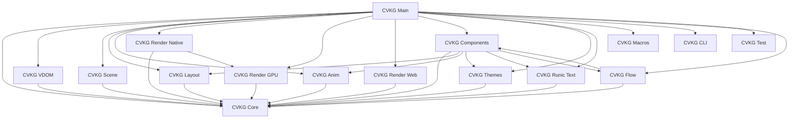

# Architecture

This document describes how the CVKG crates fit together.

## Data Flow

```
┌─────────────────┐     ┌──────────────┐     ┌──────────────┐
│   Application   │────▶│ View Bodies  │────▶│  VDOM Diff   │
│  (cvkg crate)   │     │ (cvkg-core)  │     │(cvkg-vdom)    │
└─────────────────┘     └──────────────┘     └──────────────┘
                                                  │
                                                  ▼
┌─────────────────┐     ┌──────────────┐     ┌──────────────┐
│   Renderer      │◀────│ Scene Graph  │◀────│ Layout Pass  │
│ (cvkg-render-*) │     │(cvkg-scene)  │     │(cvkg-layout)  │
└─────────────────┘     └──────────────┘     └──────────────┘
```

## Dependency Graph



## Key Subsystems

### View System (cvkg-core)

The `View` trait is the fundamental building block. Every UI component implements this trait:

```rust
pub trait View: Sized + Send {
    type Body: View;
    fn body(self) -> Self::Body;
    fn render(&self, renderer: &mut dyn Renderer, rect: Rect);
    fn intrinsic_size(&self, renderer: &mut dyn Renderer, proposal: SizeProposal) -> Size;
}
```

Modifier methods (`padding()`, `background()`, `on_click()`) are defined on the trait directly, returning `ModifiedView<Self, M>`.

### Renderer Abstraction (cvkg-core)

The `Renderer` trait abstracts drawing operations:

```rust
pub trait Renderer: ElapsedTime + Send {
    fn fill_rect(&mut self, rect: Rect, color: [f32; 4]);
    fn stroke_rect(&mut self, rect: Rect, color: [f32; 4], stroke_width: f32);
    fn draw_text(&mut self, text: &str, x: f32, y: f32, size: f32, color: [f32; 4]);
}
```

Implementors: `SurtrRenderer` (cvkg-render-gpu), concrete native renderer (cvkg-render-native), `WasmRenderer` (cvkg-render-web).

### Virtual DOM (cvkg-vdom)

The `VNode` struct represents a node in the virtual tree. `VBox::patch()` applies `VDomPatch` mutations to update the tree.

### Layout Engine (cvkg-layout)

`HStack` and `VStack` implement the `LayoutView` trait. They compute child positions using `size_that_fits()` and `place_subviews()`.

### Scene Graph (cvkg-scene)

`SceneGraph` manages `VNode` instances with world-space bounds, dirty tracking, and layer-based batching.

### Animation System (cvkg-anim)

`SleipnirSolver` implements RK4 integration for spring physics. `Animation` enum describes transition types.

## Design Decisions

### Why Stateless VDOM?

The VDOM is stateless to enable efficient diffing. State lives in `State<T>` containers that implement `Clone`.

### Why Trait Objects for Renderer?

The `Renderer` trait uses `&mut dyn Renderer` for object safety. Concrete types like `SurtrRenderer` should use `&mut Self` internally for performance.

### Why Separate Layout Crate?

Layout algorithms are complex and platform-independent. Separating them allows reuse across renderers.

## What is Intentionally Out of Scope

- Web server framework (see cvkg-webkit-server for development server)
- Database integration
- Networking protocols beyond rendering context
- Mobile platform support (iOS, Android)