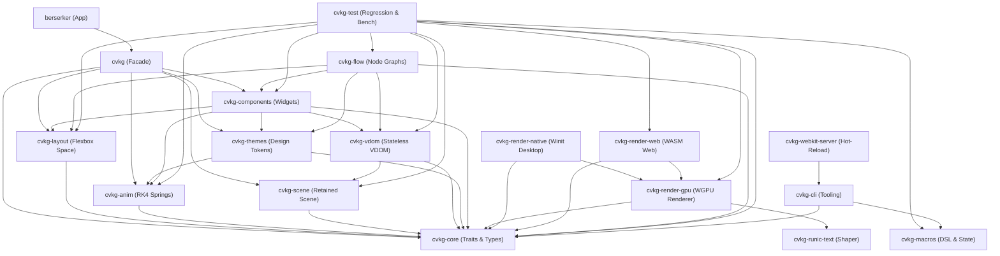

# Architecture Overview

This document describes the structure, data flow, and subsystems of the Cyber Viking Kvasir Graph (CVKG) framework.

---

## Crate Dependency Topology

The CVKG framework is divided into independent crates to separate compositional logic, platform adapters, and visual drawing pipelines. The dependency flow is strictly directed downward toward the core.

---

## Subsystems Reference

The framework isolates functional responsibilities into distinct modules. Below is a description of the key types and traits that define each major subsystem.

### 1. View Composition & Reactivity
Defines the declarative building blocks of the interface and manages data bindings.
- **Primary Crate**: `cvkg-core`
- **Key Traits**:
  - `View` — The primary unit of UI composition. Every component implements this trait and returns a hierarchical tree via its `body()` method.
  - `Renderer` — The drawing interface exposed to primitive views for geometric commands.
  - `ViewModifier` — Trait for extending views with styling, positioning, or custom shader effects.
- **Key Structs**:
  - `Binding<T>` — Read/write pointer to a state location that triggers view updates on modification.
  - `State<T>` — Authoritative storage container for reactive variables.
  - `YggdrasilTokens` — Container for global styling parameters.

### 2. State Reconciliation
Manages UI tree transformations, tracking nodes and calculating visual updates.
- **Primary Crate**: `cvkg-vdom`
- **Key Structs**:
  - `VNode` — A stateless representation of a view node including properties, geometry, and event handler keys.
  - `VDom` — The hierarchical Virtual DOM tree.
  - `VDomPatch` — Mutations (Create, Update, Delete, Move) computed by tree diffing.
  - `VNodeRenderer` — Driver that evaluates a composed `View` tree to populate a logical `VDom`.

### 3. Layout Engine
Calculates spatial positions and dimensions.
- **Primary Crate**: `cvkg-layout`
- **Key Structs**:
  - `SizeProposal` — Dimensions proposed by a parent container to its children.
  - `Size` — Bounding dimensions resolved by a child view.
  - `HStack` / `VStack` / `Grid` — Primary layout containers that distribute viewport coordinates.

### 4. Retained Scene Graph
Accelerates frame rendering, culling, and interactive hit testing.
- **Primary Crate**: `cvkg-scene`
- **Key Structs**:
  - `SceneGraph` — Retained visual tree holding pre-tessellated geometries.
  - `SceneNode` — Individual spatial node containing absolute canvas bounds.

### 5. Animation Solver
Calculates motion transitions using mathematical solvers.
- **Primary Crate**: `cvkg-anim`
- **Key Structs**:
  - `SleipnirSolver` — A fourth-order Runge-Kutta (RK4) numerical integrator for spring physics.
  - `SleipnirParams` — Configuration storing mass, stiffness, and damping coefficients.
  - `RubberBand` — Logarithmic boundary resistance solver for scrolling or dragging overflow.

### 6. Text Shaping & Layout
Translates unicode characters into positioned, renderable glyph instances.
- **Primary Crate**: `cvkg-runic-text`
- **Key Structs**:
  - `RunicTextEngine` — High-performance shaper wrapping HarfBuzz and Swash rasterizers.
  - `ShapedText` — A fully wrapped, positioned set of glyph outputs.
  - `GlyphInstance` — Position offset and font index mapping for a single character glyph.

### 7. Graphics Pipeline (Surtr)
Draws geometric meshes and compiles GPU rendering programs.
- **Primary Crate**: `cvkg-render-gpu`
- **Key Structs**:
  - `SurtrRenderer` — WGPU pipeline manager driving command buffers, multi-pass filters, and render targets.
  - `Vertex` — Vertex description including position coordinates, color vectors, and effect parameters.
  - `DrawCall` — GPU execution request batched by texture and transparency level.

---

## Design Decisions

Several architectural choices separate CVKG from conventional UI systems.

1. **Separation of VDOM (`cvkg-vdom`) and Scene Graph (`cvkg-scene`)**:
   Reconciliation operates on logical state diffs to determine which views have mutated. However, redrawing, hierarchical AABB culling, and sub-pixel event hit-testing require spatial indexing. Keeping these two structures distinct prevents state management code from polluting hardware-accelerated spatial calculations.
2. **Spring Physics Solver Over Pre-baked Splines**:
   Animation in CVKG is computed iteratively at runtime using `SleipnirSolver`'s RK4 integration. Pre-baked cubic Bezier curves cannot handle mid-motion interruptions gracefully. Spring solvers allow animations to change targets instantly while retaining velocity, eliminating visual hitching.
3. **Stand-alone Text shaping (`cvkg-runic-text`)**:
   Text shaping is computationally heavy and interacts with volatile operating system font databases. Isolate this complexity to prevent OS font-linking quirks and external library compilation cycles from impacting core framework compilation speed.

---

## Out of Scope

The CVKG project is focused strictly on highly interactive, custom graphic user interfaces. The following items are out of scope:

- **HTML/CSS Browser Emulation**: CVKG does not parse CSS stylesheets or compile standard HTML structures. It is a direct GPU UI engine.
- **Database Management & SQL Systems**: Crate libraries do not provide ORM layers or SQL drivers. Developers leverage standard database connectors.
- **Operating System Control Wrappers**: The engine does not hook into platform-native widgets (like Cocoa NSView or Win32 Buttons). To guarantee visual identity across targets, all widgets are drawn procedurally from scratch on the GPU canvas.