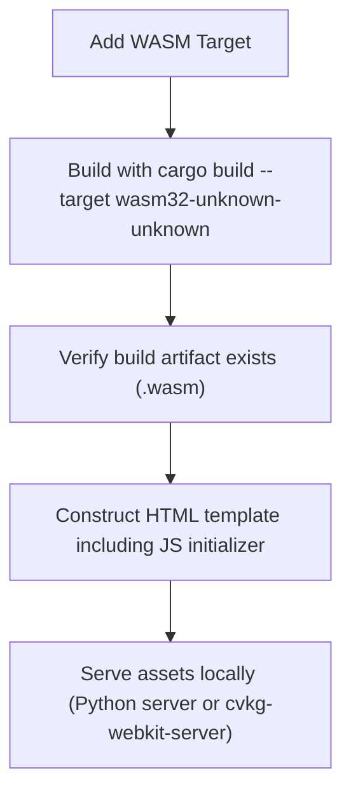

# How to Build for Web

Goal: Compile a CVKG application to WebAssembly for browser deployment.

## Process Flow



## Prerequisites


- Rust WASM target installed
- Web server for local testing

## Steps

### 1. Add WASM target

```bash
rustup target add wasm32-unknown-unknown
```

### 2. Build for WebAssembly

```bash
cargo build --target wasm32-unknown-unknown --features web --release
```

### 3. Locate output

```bash
ls target/wasm32-unknown-unknown/release/*.wasm
```

### 4. Create HTML wrapper

```html
<!DOCTYPE html>
<html>
<head>
  <title>CVKG App</title>
</head>
<body>
  <canvas id="canvas"></canvas>
  <script type="module">
    import init from './cvkg.js';
    init();
  </script>
</body>
</html>
```

### 5. Serve locally

```bash
# Using Python
python -m http.server 8000

# Or using cvkg-webkit-server
cvkg-webkit-server --port 8000 --root ./dist
```

## Expected Output

Navigate to `http://localhost:8000` to see the CVKG application running in the browser.

## Recovery

If the page is blank:

1. Check browser console for errors
2. Verify WebGPU is supported (Chrome 113+, Firefox 115+)
3. Ensure canvas element exists with correct ID