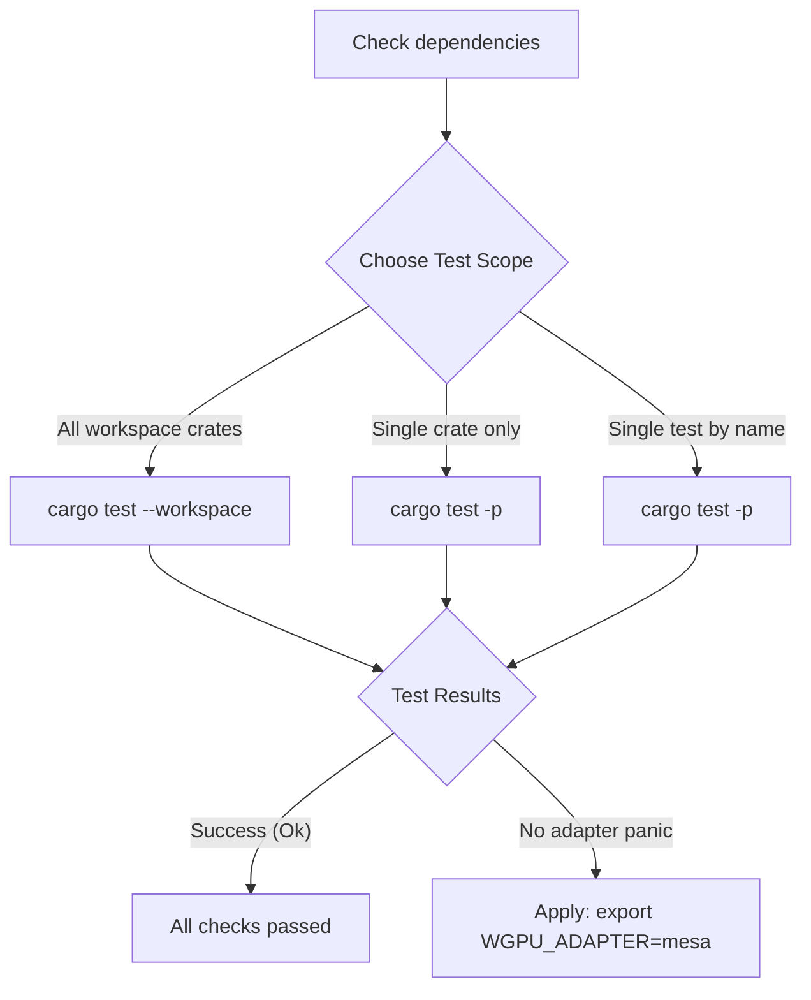

# How to Run Tests

Goal: Execute the test suite for CVKG.

## Process Overview



## Prerequisites


- Build dependencies installed (see onboarding.md)

## Steps

### Run the full test suite

```bash
cargo test --workspace
```

### Run a single crate's tests

```bash
cargo test -p cvkg-core
cargo test -p cvkg-render-gpu
cargo test -p cvkg-components
```

### Run a single test by name

```bash
cargo test -p cvkg-core test_view_trait
```

### Run integration tests only

```bash
cargo test --workspace --test '*'
```

### Run with output visible

```bash
cargo test --workspace -- --nocapture
```

## Expected Output

```
running N tests
test result: ok. N passed; 0 failed; 0 ignored
```

## Recovery

If tests fail with "no adapter found":

```bash
export WGPU_ADAPTER=mesa
cargo test -p cvkg-render-gpu
```