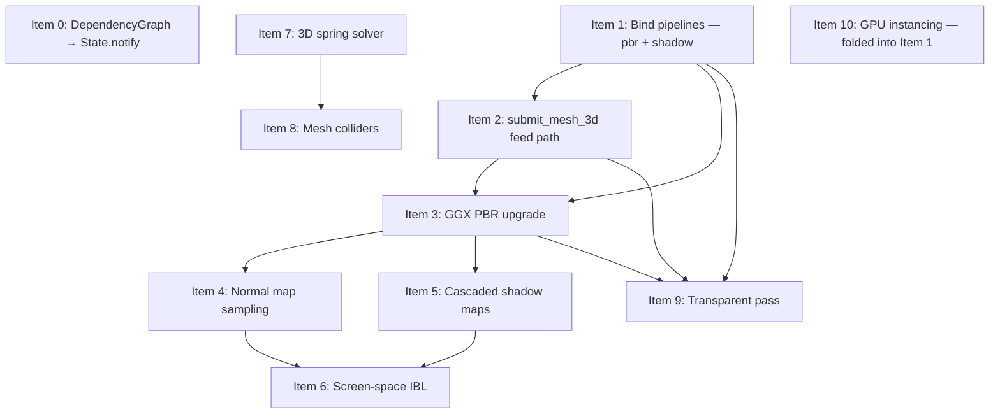

# CVKG — Bevy Gap Implementation Plan

## Background

Two categories of gaps: **3D rendering depth** (pipeline wiring, lighting quality, shadow
quality, instancing) and **reactive precision** (DependencyGraph wired into State fan-out).
The items below are ordered so that every item's prerequisites land before it.

---

## Item 0 — DependencyGraph → State fan-out

### Current state

`cvkg-core/src/dependency.rs` is complete. `DependencyGraph` has `register`,
`unregister`, `clear_component`, `affected_components`, and `has_dependents`.
`clear_component` already exists — v1 said it needed to be added. It does not.

`cvkg-core/src/state.rs` L112–113 still fans out to all subscribers unconditionally:
```rust
fn notify(&self, value: &T) {
    invoke_subscribers_safely(&self.subscribers, value);
}
```
There is no `state_key` field and no `DependencyGraph` reference on `State<T>`.

### Required changes

1. **`cvkg-core/src/state.rs`** — Add `state_key: u64` (a stable hash of the type
   path, computed once at construction) and
   `dep_graph: Option<Arc<RwLock<DependencyGraph>>>` to `State<T>`. Change `notify`:
   ```rust
   fn notify(&self, value: &T) {
       if let Some(graph) = &self.dep_graph {
           let graph = graph.read().unwrap();
           if graph.has_dependents(self.state_key) {
               // narrow fan-out: only affected components
               let ids: Vec<u64> = graph.affected_components(self.state_key).collect();
               invoke_subscribers_by_id(&self.subscribers, value, &ids);
               return;
           }
       }
       // fallback: full fan-out when no graph is attached
       invoke_subscribers_safely(&self.subscribers, value);
   }
   ```

2. **`cvkg-core/src/state.rs`** — Expose:
   ```rust
   pub fn attach_dep_graph(&mut self, graph: Arc<RwLock<DependencyGraph>>, key: u64)
   pub fn register_dependency(&self, component_id: u64)   // delegates to graph.register
   pub fn unregister_dependency(&self, component_id: u64) // delegates to graph.unregister
   ```

3. **`cvkg-core/src/lib.rs`** — Re-export `DependencyGraph` (not currently exported).

### Files
| File | Change |
|---|---|
| `cvkg-core/src/state.rs` | `state_key`, `dep_graph`, narrowed `notify`, `attach_dep_graph` |
| `cvkg-core/src/dependency.rs` | No changes — API is already complete including `clear_component` |
| `cvkg-core/src/lib.rs` | `pub use dependency::DependencyGraph` |

---

## Item 1 — Bind pipelines in Opaque3dNode and ShadowNode *(unblocks 2–10)*

### Current state

`passes/opaque3d.rs` creates a render pass with color + depth attachments but calls
`draw_indexed` with no preceding `pass.set_pipeline(...)`. `passes/shadow.rs` is the
same — depth-only pass, no pipeline bound.

**v1 was correct that `pbr_pipeline` and `shadow_pipeline` do not exist as fields.**
The existing fields on `GpuRenderer` are: `pipeline`, `opaque_pipeline`, `ui_pipeline`,
`glass_pipeline`, `background_pipeline`, `bloom_extract_pipeline`, `copy_pipeline`,
`composite_pipeline`, `color_blind_pipeline`, `volumetric_pipeline`,
`kawase_down_pipeline`, `kawase_up_pipeline`, `particle_render_pipeline`.
None of these are a PBR or shadow depth-only pipeline.

**v1 suggested adding `pbr_pipeline` and `shadow_pipeline` refs to `ExecutionContext`.**
`ExecutionContext` already carries `renderer: &'a GpuRenderer` (immutable ref). Nodes
can reach `ctx.renderer.pbr_pipeline` directly once the field exists — no need to
add duplicate top-level fields to `ExecutionContext`. The plan step to add them to the
struct is unnecessary and would create ambiguity.

`vs_main_3d` **already exists** in `common.wgsl` (L149). It reads `VertexInput3D` with
per-instance model matrix at locations 16–21, applies `scene.proj * scene.view * model *
position`, and outputs `world_pos_3d`, `world_normal`. The PBR pipeline can use it
immediately without a new vertex entry point — that resolves Item 10's shader work too
(see below).

### Required changes

1. **`renderer/pipelines.rs`** — Add two new pipeline constructors:
   - `create_pbr_pipeline(device, layout, format, msaa)` — uses `vs_main_3d` as vertex
     entry, `fs_main` (material_pbr.wgsl) as fragment, color + depth attachments,
     depth write enabled, `GreaterEqual` compare (matches the existing geometry pass).
     Vertex buffer layout: `Vertex::desc()` for buffer 0, `InstanceData3D::desc()` for
     buffer 1 (step mode `Instance`). `InstanceData3D::desc()` already exists in
     `vertex.rs`.
   - `create_shadow_pipeline(device, layout)` — depth-only, no color target, uses a
     minimal vertex-only shader (or reuse `vs_main_3d` with an empty fragment).

2. **`renderer/mod.rs`** — Add fields:
   ```rust
   pub(crate) pbr_pipeline: wgpu::RenderPipeline,
   pub(crate) shadow_pipeline: wgpu::RenderPipeline,
   ```

3. **`renderer/init.rs`** — Compile both in the pipeline construction block alongside
   the existing pipelines.

4. **`passes/opaque3d.rs`** — `pass.set_pipeline(&ctx.renderer.pbr_pipeline)` before
   the draw loop.

5. **`passes/shadow.rs`** — `pass.set_pipeline(&ctx.renderer.shadow_pipeline)` before
   the draw loop. Also: `_light_vp` (currently discarded with underscore prefix) must
   be written into `SceneUniforms.light_vp` before the pass runs so the PBR shader's
   `sample_shadow` call gets the correct matrix. Do this via
   `ctx.renderer.queue.write_buffer(...)` on `ctx.renderer.scene_buffer` before the
   shadow render pass is encoded. **This is a new requirement not in v1.**

### Files
| File | Change |
|---|---|
| `renderer/pipelines.rs` | `create_pbr_pipeline`, `create_shadow_pipeline` |
| `renderer/mod.rs` | `pbr_pipeline`, `shadow_pipeline` fields |
| `renderer/init.rs` | Compile both pipelines during init |
| `passes/opaque3d.rs` | `pass.set_pipeline(ctx.renderer.pbr_pipeline)` |
| `passes/shadow.rs` | `pass.set_pipeline(ctx.renderer.shadow_pipeline)`; write `light_vp` to scene buffer |

---

## Item 2 — Feed mesh_instances_3d from Renderer trait

### Current state

`renderer/draw.rs` L1011: `mesh_instances_3d: Vec::new()` — always empty. No geometry
reaches `ShadowNode` or `Opaque3dNode`. `GpuMesh3d` in `passes/shadow.rs` already
carries pre-uploaded `vertex_buffer`, `index_buffer`, `index_count`, `transform: Mat4`.

**v1 pointed to `cvkg-core/src/gpu.rs` as the location for the new trait method.
The `Renderer` trait is in `cvkg-core/src/renderer_trait.rs`, not `gpu.rs`.**
`gpu.rs` contains `InstanceTransform`, `InstanceColor`, `DrawBatch` — GPU batching
primitives, not the Renderer trait. The method must go in `renderer_trait.rs`.

**`InstanceData3D` already exists** in `cvkg-render-gpu/src/vertex.rs` (L42–51) with a
3×4 model matrix, `material_overrides`, `uv_scale`, `uv_offset`, and a correct
`desc()` method. v1's open question "Item 10 may require creating `InstanceData3D` from
scratch" is resolved — it exists and is complete.

### Required changes

1. **`cvkg-core/src/renderer_trait.rs`** (not `gpu.rs`) — Add to `Renderer` trait:
   ```rust
   fn submit_mesh_3d(
       &mut self,
       mesh: &Mesh,
       material: &Material3D,
       transform: &Transform3D,
   ) {}
   ```
   Default no-op so existing backends (software, mock) don't break.

2. **`renderer/mod.rs`** — Add staging field:
   ```rust
   pub(crate) pending_mesh_instances_3d: Vec<GpuMesh3d>,
   pub(crate) pending_directional_light: Option<DirectionalLight>,
   pub(crate) pending_scene_radius: f32,
   ```
   Clear all three in `reset_frame_state`.

3. **`GpuRenderer::submit_mesh_3d`** — Upload `mesh.vertices` and `mesh.indices` to
   new GPU buffers via `device.create_buffer_init`, wrap into `GpuMesh3d`, push to
   `pending_mesh_instances_3d`. Extract `DirectionalLight` from `SceneUniforms`
   (direction and color are already fields — no separate parameter needed).

4. **`renderer/draw.rs` L1011** — Replace:
   ```rust
   mesh_instances_3d: Vec::new(),
   directional_light: None,
   scene_radius: 100.0,
   ```
   with:
   ```rust
   mesh_instances_3d: std::mem::take(&mut self.pending_mesh_instances_3d),
   directional_light: Some(DirectionalLight {
       direction: glam::Vec3::from(self.current_scene.light_direction),
       color: glam::Vec3::from(self.current_scene.light_color),
       intensity: 1.0,
   }),
   scene_radius: self.pending_scene_radius,
   ```

5. **`cvkg-render-native/src/renderer.rs`** — Forward `submit_mesh_3d` through
   `NativeRenderer`.

### Files
| File | Change |
|---|---|
| `cvkg-core/src/renderer_trait.rs` | `submit_mesh_3d` default method on `Renderer` trait |
| `renderer/mod.rs` | `pending_mesh_instances_3d`, `pending_directional_light`, `pending_scene_radius` |
| `renderer/draw.rs` | Drain staging vec and populate light from `current_scene` |
| `cvkg-render-native/src/renderer.rs` | Forward `submit_mesh_3d` |

---

## Item 3 — Upgrade PBR to GGX BRDF

### Current state

`shaders/material_pbr.wgsl` mode 13 uses Blinn-Phong:
`shininess = mix(8.0, 256.0, 1.0 - roughness)` + `pow(n_dot_h, shininess)`.
Ambient is hardcoded `vec3(0.06, 0.07, 0.1)`.

**v1 stated "grep shows no WGSL-level GGX in any shader — they must be added fresh."
This is incorrect.** `material_glass.wgsl` contains `ggx_ndf`, `geometry_smith` (via
Smith's method), and Schlick Fresnel (`f0 = 0.04`). These can be lifted directly into
`material_pbr.wgsl` rather than written from scratch.

`SceneUniforms` is defined in **`cvkg-core/src/render_tier.rs`** (not `renderer/mod.rs`
or a `types.rs` — neither of which contains it). It is `repr(C)` + `Pod` + `Zeroable`.
Any new field must maintain 16-byte alignment. The struct currently ends with
`light_vp: glam::Mat4` (64 bytes, already 16-byte aligned). Appending
`ambient_color: [f32; 4]` (16 bytes) is safe and alignment-preserving.

### Required changes

1. **`shaders/material_pbr.wgsl`** — Copy `ggx_ndf`, `ggx_specular` (or equivalent
   Smith G), and `fresnel_schlick` from `material_glass.wgsl`. In mode 13 `fs_main`,
   replace the Blinn-Phong specular block with a Cook-Torrance lobe:
   ```wgsl
   let d   = ggx_ndf(n_dot_h, roughness);
   let g   = geometry_smith(n, view_dir, light_dir, roughness);
   let f   = fresnel_schlick(max(dot(half_dir, view_dir), 0.0), f0);
   let spec = (d * g * f) / max(4.0 * n_dot_v * n_dot_l, 0.001);
   ```

2. **`cvkg-core/src/render_tier.rs`** — Append to `SceneUniforms`:
   ```rust
   pub ambient_color: [f32; 4],  // rgb + intensity in w; 16 bytes, keeps alignment
   ```
   Add default `ambient_color: [0.06, 0.07, 0.1, 1.0]` in `SceneUniforms::new`.
   Update the corresponding WGSL `SceneUniforms` struct in `common.wgsl` to match.
   **This is a buffer layout change — recompile all shaders and verify the 16-byte
   alignment assertion in `tests/scene_uniforms_3d_tests.rs` still passes.**

3. **`shaders/material_pbr.wgsl` and `material_opaque.wgsl`** — Replace hardcoded
   ambient constant with `scene.ambient_color.rgb * scene.ambient_color.w`.

### Files
| File | Change |
|---|---|
| `shaders/material_pbr.wgsl` | GGX functions lifted from glass shader; Cook-Torrance specular |
| `cvkg-core/src/render_tier.rs` | `ambient_color: [f32; 4]` appended to `SceneUniforms` |
| `shaders/common.wgsl` | `ambient_color: vec4<f32>` in WGSL `SceneUniforms` |
| `cvkg-core/tests/scene_uniforms_3d_tests.rs` | Add alignment test for new field size |

---

## Item 4 — Normal map sampling in PBR shader

### Current state

`cvkg-core/src/mesh.rs` has `vertices`, `normals`, `tex_coords` — no tangents.
`VertexInput3D` in `common.wgsl` (L107–121) has `position`, `normal`, `uv`, `color`
and instance attributes at locations 16–21. **Location 4 is already occupied in
`VertexInput` (the 2D path) by `material_id`.** The tangent slot must go into
`VertexInput3D` specifically, not into the shared `VertexInput`. Use `@location(4)`
inside `VertexInput3D` — it is independent of the 2D path's location numbering because
they use separate pipeline vertex buffer descriptors.

### Required changes

1. **`cvkg-core/src/mesh.rs`** — Add `pub tangents: Vec<[f32; 4]>` (xyz + w handedness).
   Compute in `Mesh::from_obj` using the Lengyel algorithm (~30 lines): for each
   triangle accumulate tangent and bitangent from UV deltas, then orthogonalise against
   the normal and encode handedness in w. Set all `[0.0, 0.0, 1.0, 1.0]` in
   `Mesh::from_stl` (STL has no UVs so flat tangents are the correct fallback).

2. **`shaders/common.wgsl` `VertexInput3D`** — Add:
   ```wgsl
   @location(4) tangent: vec4<f32>,
   ```
   Add `@location(15) tangent: vec4<f32>` to `VertexOutput` for interpolation to
   the fragment shader.

3. **`renderer/pipelines.rs` PBR pipeline vertex descriptor** — Add tangent attribute
   at shader location 4, `Float32x4`, offset after normal (bytes 12–28 if tightly
   packed) in the per-vertex buffer.

4. **`shaders/material_pbr.wgsl` mode 13** — Sample `t_normal`, decode:
   ```wgsl
   @group(3) @binding(6) var t_normal: texture_2d<f32>;
   @group(3) @binding(7) var s_normal: sampler;

   let n_ts  = normalize(textureSample(t_normal, s_normal, in.uv).xyz * 2.0 - 1.0);
   let b     = cross(in.world_normal, in.tangent.xyz) * in.tangent.w;
   let tbn   = mat3x3<f32>(in.tangent.xyz, b, in.world_normal);
   let n     = normalize(tbn * n_ts);
   ```
   When `Material3D.normal_map_texture` is `None`, bind the 1×1 flat-normal fallback
   `[0.5, 0.5, 1.0, 1.0]` texture.

5. **`renderer/init.rs`** — Create the 1×1 flat-normal fallback texture once during
   init. Reuse the existing flat-white fallback texture pattern already present for
   diffuse.

### Files
| File | Change |
|---|---|
| `cvkg-core/src/mesh.rs` | `tangents` field; Lengyel tangent computation in `from_obj`; flat fallback in `from_stl` |
| `shaders/common.wgsl` | `@location(4) tangent` in `VertexInput3D`; `@location(15) tangent` in `VertexOutput` |
| `renderer/pipelines.rs` | Tangent attribute in PBR pipeline vertex descriptor |
| `shaders/material_pbr.wgsl` | Normal map binding (group 3 binding 6/7), TBN construction |
| `renderer/init.rs` | 1×1 flat-normal fallback texture |

---

## Item 5 — Cascaded Shadow Maps (4-cascade) [COMPLETE]

### Current state

`passes/shadow.rs` — single orthographic frustum from `scene_radius: f32`.
`renderer/mod.rs` — `shadow_map_texture: Option<wgpu::Texture>` (single 2D depth
texture, allocated lazily, currently `None` at init).

`SceneUniforms` in `render_tier.rs` has `shadow_map_size: f32`, `shadow_bias: f32`,
`light_vp: glam::Mat4` — one VP matrix. CSM requires 4 VP matrices and 4 split depths.
Adding `cascade_vps: [glam::Mat4; 4]` (256 bytes) and `cascade_splits: [f32; 4]`
(16 bytes) to `SceneUniforms` is a significant size increase that will change the
buffer alignment. Plan this as a separate `CsmUniforms` uniform buffer bound at a new
`@group(2) @binding(2)` to avoid rewriting every shader that reads `scene`.

### Required changes

1. **`cvkg-core/src/render_tier.rs`** — Add new `repr(C)` struct:
   ```rust
   pub struct CsmUniforms {
       pub cascade_vps: [glam::Mat4; 4],    // 256 bytes
       pub cascade_splits: [f32; 4],         // 16 bytes
       pub _pad: [f32; 4],                   // 16 bytes — 16-byte alignment
   }
   ```

2. **`renderer/mod.rs`** — Add `csm_buffer: wgpu::Buffer` and
   `shadow_map_texture: wgpu::Texture` changed to an array texture:
   ```rust
   dimension: wgpu::TextureDimension::D2,
   size: wgpu::Extent3d { array_layer_count: 4, ... },
   ```

3. **`renderer/init.rs`** — Allocate `shadow_map_texture` as a `texture_depth_2d_array`
   with 4 layers at init (not lazily). Create `csm_buffer`. Add `csm_buffer` to a new
   `@group(2) @binding(2)` entry in the berserker bind group layout.

4. **`passes/shadow.rs`** — Replace `scene_radius: f32` with `cascade_splits: [f32; 4]`
   and `camera_view_proj: Mat4`. Render 4 sub-passes, one per cascade layer, targeting
   the corresponding array layer. Compute each cascade's orthographic frustum by
   transforming the camera frustum corners into light space.

5. **`shaders/material_pbr.wgsl`** — Add:
   ```wgsl
   @group(2) @binding(2) var<uniform> csm: CsmUniforms;
   @group(3) @binding(4) var t_shadow: texture_depth_2d_array;
   ```
   In `sample_shadow`, determine cascade index from fragment view depth vs
   `csm.cascade_splits`, project into `csm.cascade_vps[cascade_idx]`, sample the
   corresponding array layer.

6. **`kvasir/nodes.rs` `RenderGraphConfig`** — Replace `scene_radius` with
   `cascade_splits: [f32; 4]` and `camera_view_proj: Mat4`.

### Files
| File | Change |
|---|---|
| `cvkg-core/src/render_tier.rs` | New `CsmUniforms` struct |
| `renderer/mod.rs` | `csm_buffer`, array depth texture (4 layers) |
| `renderer/init.rs` | Allocate array shadow texture and CSM buffer at init |
| `passes/shadow.rs` | 4-cascade frustum split, array layer rendering |
| `shaders/material_pbr.wgsl` | `texture_depth_2d_array`, cascade index logic |
| `shaders/common.wgsl` | `CsmUniforms` WGSL struct at binding 2 |
| `kvasir/nodes.rs` | `cascade_splits` + `camera_view_proj` in `RenderGraphConfig` |

---

## Item 6 — Screen-Space IBL from Glass blur pyramid *(CVKG-unique)* [COMPLETE]

### Current state

`RES_BLUR_A` is a Kawase blur pyramid of the rendered scene, allocated by
`BackdropCopyNode` only when `has_glass` is true. `material_pbr.wgsl` has no IBL
sampling; ambient is the hardcoded constant (replaced by Item 3).

**IBL bind group slot:** v1 proposed `@group(3) @binding(7)`. Item 4 uses bindings 6
and 7 for the normal map texture and sampler. IBL must use **binding 8**.

**IBL fallback:** when `has_glass` is false, `RES_BLUR_A` is not allocated. Bind the
same 1×1 white fallback texture created for normal maps in Item 4 (reuse, don't
create a second one). The shader should read `has_ibl` from a push constant or a
`SceneUniforms` flag bit; the simplest approach is a `u32 ibl_enabled` flag in
`SceneUniforms` (1 field, 4 bytes, fits in the next padding slot after Item 3's
`ambient_color`).

### Required changes

1. **`cvkg-core/src/render_tier.rs`** — Add `pub ibl_enabled: u32` to `SceneUniforms`
   after `ambient_color` (using available padding). Default `0`.

2. **`shaders/common.wgsl`** — Add `ibl_enabled: u32` to the WGSL `SceneUniforms`.

3. **`kvasir/nodes.rs` `RenderGraphConfig`** — Add `has_ibl: bool`.
   Set `has_ibl = has_glass` in `build_render_graph` — IBL is only available when
   the blur pyramid is allocated.

4. **`shaders/material_pbr.wgsl`** — Add at group 3:
   ```wgsl
   @group(3) @binding(8) var t_ibl: texture_2d<f32>;
   @group(3) @binding(9) var s_ibl: sampler;
   ```
   In mode 13 `fs_main`:
   ```wgsl
   if scene.ibl_enabled != 0u {
       let reflect_ws  = reflect(-view_dir, n);
       let reflect_cs  = scene.proj * scene.view * vec4<f32>(in.world_pos + reflect_ws, 1.0);
       let screen_uv   = reflect_cs.xy / reflect_cs.w * 0.5 + 0.5;
       let ibl_mip     = roughness * 4.0;
       let ibl_sample  = textureSampleLevel(t_ibl, s_ibl, screen_uv, ibl_mip);
       lit_color      += ibl_sample.rgb * fresnel * (1.0 - roughness);
   }
   ```

5. **`passes/opaque3d.rs`** — Bind `RES_BLUR_A` texture view (or 1×1 fallback) to
   bind group slot 8 before draw calls.

6. **`renderer/draw.rs`** — Set `self.current_scene.ibl_enabled = has_ibl as u32`
   before writing the scene uniform buffer.

### Files
| File | Change |
|---|---|
| `cvkg-core/src/render_tier.rs` | `ibl_enabled: u32` in `SceneUniforms` |
| `shaders/common.wgsl` | `ibl_enabled` in WGSL `SceneUniforms` |
| `kvasir/nodes.rs` | `has_ibl` in `RenderGraphConfig` |
| `shaders/material_pbr.wgsl` | IBL texture bindings 8/9; screen-space specular term |
| `passes/opaque3d.rs` | Bind `RES_BLUR_A` or fallback to group 3 binding 8 |
| `renderer/draw.rs` | Set `ibl_enabled` from `has_glass` before scene buffer upload |

---

## Item 7 — 3D Spring solver for Transform3D [COMPLETE]

### Current state

`cvkg-core/src/spring.rs` — `SpringSolver` (scalar RK4), `SpringParams` (stiffness,
damping, mass). `cvkg-anim/src/lib.rs` has a second `SpringSolver` duplicate at L251.
`WorldSpacePanel.transform` is already `Transform3D`.

**v1's `SpringSolverQuat` design (SLERP-damped) is correct in intent but incomplete.**
SLERP alone does not produce damped oscillation. The correct approach is to maintain
an angular velocity `Vec3` in axis-angle space, apply spring force as a torque toward
the target quaternion's log-map, and integrate with the existing RK4 machinery.

**Open question from v1 — who drives the per-frame tick** — resolved as follows:
`FrameScheduler` already has a typed `FramePhase::Animation` phase. `Motion3D`
instances should be registered with the scheduler via the `FrameManifest` pattern
(already in place in `cvkg-anim`'s manifest). The scheduler calls
`cvkg_anim::tick_motion3d(dt)` each frame in the Animation phase.

### Required changes

1. **`cvkg-core/src/spring.rs`** — Add `SpringSolver3D`:
   ```rust
   pub struct SpringSolver3D {
       params: SpringParams,
       x: SpringSolver,
       y: SpringSolver,
       z: SpringSolver,
   }
   impl SpringSolver3D {
       pub fn new(params: SpringParams, target: Vec3, current: Vec3) -> Self
       pub fn set_target(&mut self, t: Vec3)
       pub fn tick(&mut self, dt: f32) -> Vec3
       pub fn is_settled(&self) -> bool
   }
   ```

2. **`cvkg-core/src/spring.rs`** — Add `SpringSolverQuat`:
   ```rust
   pub struct SpringSolverQuat {
       params: SpringParams,
       current: Quat,
       angular_vel: Vec3,  // axis-angle space angular velocity
   }
   impl SpringSolverQuat {
       // Drive spring force as torque toward target in log-map space
       pub fn tick(&mut self, dt: f32, target: Quat) -> Quat
       pub fn is_settled(&self, target: Quat) -> bool
   }
   ```

3. **`cvkg-anim/src/lib.rs`** — Add `Motion3D` wrapping `SpringSolver3D` (position,
   scale) and `SpringSolverQuat` (rotation), emitting `Transform3D` each tick. Register
   a `tick_motion3d(dt: f32)` function callable from `FrameScheduler`'s Animation phase.

4. **`cvkg-vdom/src/vnode.rs`** — Add to `WorldSpacePanel`:
   ```rust
   pub spring: Option<SpringParams>,
   ```
   The framework auto-creates a `Motion3D` for any panel where `spring.is_some()` and
   drives it toward `panel.transform` each Animation phase tick.

### Files
| File | Change |
|---|---|
| `cvkg-core/src/spring.rs` | `SpringSolver3D`, `SpringSolverQuat` |
| `cvkg-core/src/lib.rs` | Re-export new types |
| `cvkg-anim/src/lib.rs` | `Motion3D`, `tick_motion3d` |
| `cvkg-vdom/src/vnode.rs` | `WorldSpacePanel.spring: Option<SpringParams>` |

---

## Item 8 — Mesh colliders for WorldSpacePanel physics [COMPLETE]

### Current state

`cvkg-physics` — 3D fields exist on `RigidBody` (`position_3d`, `velocity_3d`,
`force_3d`, `angular_velocity_3d`) but the constraint solver only uses 2D fields.
Collision shapes are AABB-only via `world_aabb_3d` (which currently returns a sphere of
radius `r` — the AABB implementation is incomplete). No convex hull type exists.

### Required changes

1. **`cvkg-physics/src/shape.rs`** (new) — `ConvexHull { vertices: Vec<Vec3>, faces:
   Vec<[u32; 3]> }`. Implement `fn quickhull(points: &[Vec3]) -> ConvexHull` using the
   incremental horizon algorithm (~200 lines, no external dependency).

2. **`cvkg-physics/src/collider.rs`** — Fix `world_aabb_3d` to actually compute the
   AABB (transform all hull vertices by position + rotation, take min/max per axis)
   rather than returning a uniform sphere.

3. **`cvkg-core/src/mesh.rs`** — Add `fn convex_hull(&self) -> ConvexHull` that
   delegates to `cvkg_physics::quickhull(&self.vertices_as_vec3())`.

4. **`cvkg-vdom/src/vnode.rs`** — `WorldSpacePanel` gains:
   ```rust
   pub physics: Option<RigidBody3D>,
   ```
   where `RigidBody3D` wraps a `cvkg_physics::RigidBody` with `is_3d: true` and a
   `CollisionShape::ConvexHull(...)` or `CollisionShape::Aabb(...)`.

5. **`cvkg-physics` XPBD solver** — Wire `WorldSpacePanel` rigid bodies into the 3D
   integration step: gravity, collision response between panels and a static floor
   plane, spring-settle constraint back to `panel.transform` (using the spring params
   from Item 7 if set).

### Files
| File | Change |
|---|---|
| `cvkg-physics/src/shape.rs` (new) | `ConvexHull`, `quickhull` |
| `cvkg-physics/src/collider.rs` | Fix `world_aabb_3d`; add convex hull shape variant |
| `cvkg-core/src/mesh.rs` | `Mesh::convex_hull()` |
| `cvkg-vdom/src/vnode.rs` | `WorldSpacePanel.physics: Option<RigidBody3D>` |
| `cvkg-physics/src/solver.rs` | 3D XPBD integration for `WorldSpacePanel` bodies |

---

## Item 9 — Transparent pass with back-to-front sorting [COMPLETE]

### Current state

`passes/geometry.rs` comment at P2-6: only opaque draw calls rendered. `DrawCall` has
`panel_id: Option<u64>` and `material: DrawMaterial`. `DrawMaterial::Glass` implies
transparency (already handled by the Glass pass). For 3D meshes with `opacity < 1.0`
(from `Material3D.opacity`, stored in `slice.z`) there is no blend pass.

**Sorting by depth requires knowing the fragment's view-space Z at draw-call time.**
Draw calls are batched, not per-triangle. The correct proxy is the mesh's bounding
sphere center depth in view space, computed when `submit_mesh_3d` pushes to
`pending_mesh_instances_3d`. Add `view_depth: f32` to `GpuMesh3d` and compute it in
`submit_mesh_3d` as `(view_matrix * world_center).z`.

### Required changes

1. **`passes/shadow.rs` `GpuMesh3d`** — Add `view_depth: f32` field.

2. **`cvkg-render-gpu/src/renderer/mod.rs`** — Add
   `pending_transparent_instances_3d: Vec<GpuMesh3d>` (separate from opaque). In
   `submit_mesh_3d`, route to the transparent staging vec when `material.opacity < 1.0`.

3. **`passes/transparent.rs`** (new) — `TransparentNode` implementing `KvasirNode`:
   - Takes `mesh_instances: Vec<GpuMesh3d>` sorted by `view_depth` descending.
   - Renders to `RES_SCENE` with `LoadOp::Load`, alpha blending enabled, depth writes
     disabled (depth test still enabled to discard fragments behind opaque geometry).

4. **`renderer/pipelines.rs`** — `create_transparent_pipeline()`: same vertex layout as
   PBR but `wgpu::BlendState::ALPHA_BLENDING` on the color target and depth write
   disabled.

5. **`renderer/mod.rs`** — `transparent_pipeline: wgpu::RenderPipeline` field.

6. **`kvasir/nodes.rs`** — Add `transparent_mesh_instances_3d: Vec<GpuMesh3d>` to
   `RenderGraphConfig`. Insert `TransparentNode` after `Opaque3dNode` in
   `build_render_graph`, before the Glass pass.

### Files
| File | Change |
|---|---|
| `passes/shadow.rs` `GpuMesh3d` | Add `view_depth: f32` |
| `renderer/mod.rs` | `pending_transparent_instances_3d`, `transparent_pipeline` |
| `passes/transparent.rs` (new) | `TransparentNode` depth-sorted draw |
| `passes/mod.rs` | `pub mod transparent` |
| `renderer/pipelines.rs` | `create_transparent_pipeline` |
| `kvasir/nodes.rs` | `transparent_mesh_instances_3d` in `RenderGraphConfig`; wire node |

---

## Item 10 — GPU-instanced mesh submission (vs_main_3d)

### Current state

`api/mod.rs` `draw_mesh_3d` CPU-bakes model matrices into vertex positions and writes
`InstanceData3D` to `self.instance_data_3d`, noting "this will be consumed by the
future `vs_main_3d` entry point."

**`vs_main_3d` already exists** in `common.wgsl` (L149). It correctly reads
`VertexInput3D` with per-instance model matrix at locations 16–21, applies
`scene.proj * scene.view * model * position`, and outputs `world_pos_3d` and
`world_normal`. **v1's Item 10 asked for this to be written — it is already written.**

**`InstanceData3D` already exists** in `vertex.rs` with full `desc()` method and
step mode `Instance`. **v1's open question about whether it exists is resolved — it does.**

The only remaining work is to wire the existing `vs_main_3d` into a compiled pipeline
and switch `Opaque3dNode` to use the instanced draw path rather than the per-mesh loop.

### Required changes

1. **`renderer/pipelines.rs`** — `create_pbr_pipeline` (from Item 1) should use
   `vs_main_3d` as its vertex entry point (not `vs_main`) and include
   `InstanceData3D::desc()` as the second vertex buffer slot. No new pipeline needed —
   this is part of Item 1.

2. **`renderer/mod.rs`** — Add a GPU-side `instance_buffer_3d: wgpu::Buffer` that
   mirrors `self.instance_data_3d`. Size it to `MAX_VERTICES / 4 *
   size_of::<InstanceData3D>()` (consistent with the Vec capacity set in `init.rs`).

3. **`renderer/frame.rs` `render_frame`** — Upload `self.instance_data_3d` to
   `instance_buffer_3d` via `StagingBelt` alongside the existing vertex/index/instance
   uploads.

4. **`passes/opaque3d.rs`** — Replace the per-mesh `draw_indexed` loop with:
   ```rust
   pass.set_vertex_buffer(0, ctx.renderer.geometry_buffers.vertex_buffer.slice(..));
   pass.set_vertex_buffer(1, ctx.renderer.instance_buffer_3d.slice(..));
   pass.set_index_buffer(...);
   pass.draw_indexed(0..total_index_count, 0, 0..instance_count);
   ```

5. **`api/mod.rs` `draw_mesh_3d`** — Remove CPU matrix bake (the `transform_point3`
   loop). Push raw vertex positions + normals + UVs as-is. Push one `InstanceData3D`
   with the model matrix rows. The vertex shader handles the transform.

### Files
| File | Change |
|---|---|
| `renderer/pipelines.rs` | PBR pipeline uses `vs_main_3d` + `InstanceData3D::desc()` — part of Item 1 |
| `renderer/mod.rs` | `instance_buffer_3d: wgpu::Buffer` field |
| `renderer/init.rs` | Allocate `instance_buffer_3d` at init |
| `renderer/frame.rs` | Upload `instance_data_3d` to GPU via StagingBelt |
| `passes/opaque3d.rs` | Instanced draw using `instance_buffer_3d` |
| `api/mod.rs` | Remove CPU matrix bake; push raw geometry + `InstanceData3D` |

---

## Execution Order



> **Note:** Item 10 is partially resolved by Item 1 (same pipeline, same vertex entry
> point). The GPU buffer upload work is independent and can run in parallel with Items
> 3–6. Items 0 and 7 are independent of the rendering track and can start immediately.

---

## Resolved Open Questions

| v1 Question | Resolution |
|---|---|
| Bind group layout collision for PBR | Normal map: bindings 6/7. IBL: bindings 8/9. Shadow: binding 4/5 (already in shader). No collision. |
| `InstanceData3D` location | Already exists in `cvkg-render-gpu/src/vertex.rs` with correct `desc()`. |
| `WorldSpacePanel` spring ownership | Driven by `FrameScheduler` Animation phase via `cvkg_anim::tick_motion3d(dt)`. |
| IBL fallback when `has_glass` is false | Reuse the 1×1 flat-normal fallback from Item 4. Set `ibl_enabled = 0` in `SceneUniforms` to skip the IBL branch in the shader. |
| `SceneUniforms` location | `cvkg-core/src/render_tier.rs` — not `renderer/mod.rs` or a `types.rs`. |
| `Renderer` trait location | `cvkg-core/src/renderer_trait.rs` — not `cvkg-core/src/gpu.rs`. |
| `vs_main_3d` status | Already implemented in `common.wgsl` L149. No new shader code needed for Item 10. |
| `clear_component` on `DependencyGraph` | Already implemented at `dependency.rs` L64. No new code needed. |
